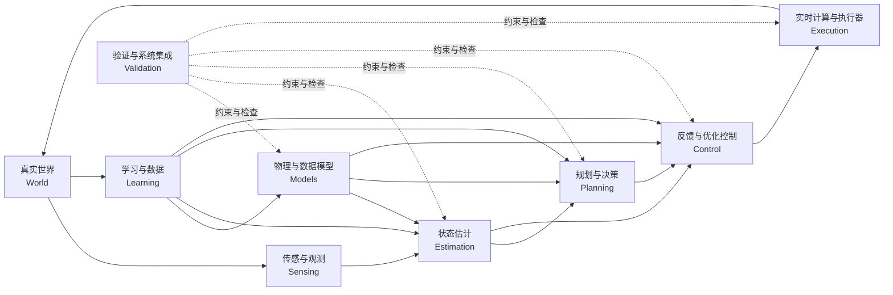

# 前言

[返回首页](../README.md) · [完整目录](../SUMMARY.md)

**小节导航**

- [0.1 为什么需要一套统一的系统观（Unified System View）](#preface-sec1)
- [0.2 从“学习算法”到“理解系统”（From Algorithms to Systems）](#preface-sec2)
- [0.3 本书的核心架构（Core Architecture）](#preface-sec3)
- [0.4 为什么不按照 PID、Kalman、MPC、RL 来组织知识](#preface-sec4)
- [0.5 领域建模与通用数学方法](#preface-sec5)
- [0.6 贯穿全书的真实系统实例](#preface-sec6)
- [0.7 理论、仿真、代码与真实硬件之间的关系](#preface-sec7)
- [0.8 如何使用本书：先建立地图，再深入细节](#preface-sec8)
- [0.9 全书主线与状态空间接口（The Spine and the Interface）](#preface-sec9)

---

<a id="preface-sec1"></a>

## 0.1 为什么需要一套统一的系统观（Unified System View）

如果第一次接触自动控制、机器人或自主系统，一种自然的学习方式是沿着算法名称不断前进：

PID、Kalman Filter、A*、RRT、LQR、MPC、轨迹优化、强化学习……

这种方式能够让人迅速接触大量工具，却也容易留下一个长期存在的困难：

> 我知道许多算法，但当一个新的物理系统真正出现在面前时，我仍然不知道应该从哪里开始。

设想一台仓储移动操作机器人。它需要在货架间自主行驶，到达指定货位后停稳，使用机械臂抓取周转箱，再把物品运送到下一个工作站。为了完成这个看似简单的任务，机器人必须同时协调移动底盘、机械臂、电机与驱动器、相机、IMU、编码器、计算机、通信总线和实时软件。

此时，真正的问题并不是先决定“使用 PID 还是 MPC”，而是依次回答一组更基础的问题：

- 任务边界是什么，机器人与环境分别包含哪些对象？
- 移动底盘、机械臂、负载、电机和传感器如何组成一个系统？
- 哪些变量足以描述系统当前的运动状态？
- 哪些量可以直接测量，哪些量只能间接推断？
- 相机、IMU、轮速计和关节编码器分别提供什么信息？
- 电压、电流、力矩、轮速和关节运动之间是什么关系？
- 当前控制输入会怎样影响未来状态？
- 障碍物、接触、摩擦、负载变化和通信延迟如何进入模型？
- 任务目标应被表达为终点、路径、轨迹、约束，还是长期代价？
- 怎样生成一条几何无碰撞且动力学可行的运动？
- 怎样让真实机器人跟随计划，而不是只在仿真中运动？
- 控制命令怎样经过数字计算、总线、驱动器和电机，最终变成真实的力与运动？
- 当模型不准确、测量有噪声、环境发生变化时，系统如何继续工作？
- 哪些部分应由物理模型承担，哪些部分适合通过数据学习？

这些问题不是互相独立的。它们共同组成了从真实世界到行动、再从行动返回真实世界的闭环：

$$
\boxed{
\text{真实世界}
\rightarrow
\text{建模}
\rightarrow
\text{估计}
\rightarrow
\text{规划}
\rightarrow
\text{控制}
\rightarrow
\text{执行}
\rightarrow
\text{真实世界}
}
$$

其中，传感器不断把真实世界的结果送回系统，形成反馈；学习则可以利用运行数据修正模型、估计器、规划器、控制器乃至任务目标。因而更完整的表达是：

$$
\boxed{
\text{建模描述世界，估计认识世界，规划选择未来，控制生成作用，执行落实作用，反馈连接现实，学习改进各个模块。}
}
$$

这条链不是一条只运行一次的流水线，而是以不同频率持续运行的多层闭环。仓储任务规划可能每隔数秒更新一次，局部轨迹可能以几十赫兹重规划，底盘和机械臂控制器可能以数百赫兹运行，电机电流环则可能达到数千乃至数万赫兹。每一层都观察某种状态、作出某种决策，并把结果交给下一层。

因此，自主系统不能被理解为若干算法的简单拼接。它首先是一个具有物理边界、信息流、能量流、时间尺度、约束和反馈的完整系统。算法只有放入这个系统之后，才具有明确的输入、输出、假设和责任。

第二版《从模型到行动：自主系统的统一方法》正是从这一事实出发。全书不以某一种机器人、某一种控制器或某一种学习范式作为唯一中心，而是试图建立一套可迁移的方法：

1. 从真实任务确定系统边界；
2. 从物理规律建立可计算模型；
3. 用状态表达系统对未来有用的信息；
4. 在不完整、有噪声的观测下估计状态；
5. 在目标与约束下规划未来；
6. 通过反馈与预测计算控制作用；
7. 在数字实时系统和真实执行器上落实控制；
8. 用数据补充模型、决策和控制；
9. 通过接口、验证与集成闭合整个系统。

这就是本书所说的“从模型到行动”。模型不是终点，行动也不是脱离模型的孤立输出。二者之间存在估计、规划、控制和执行构成的连续结构，而反馈使行动的结果重新成为下一轮推理的起点。

---

<a id="preface-sec2"></a>

## 0.2 从“学习算法”到“理解系统”（From Algorithms to Systems）

以算法名称组织知识，很容易形成一个不断扩张的“工具箱”：

```text
PID
LQR
Kalman Filter
A*
RRT
MPC
EKF
iLQR
DDP
RL
...
```

工具箱当然有价值，但工具名称并不能自动告诉我们：

- 它解决什么问题；
- 它需要哪些输入；
- 它依赖哪些假设；
- 它输出的量处于哪一个物理层级；
- 它应以什么频率运行；
- 它与其他模块如何交换信息；
- 它在什么条件下会失败。

例如，PID 使用误差信号构造反馈作用，但它并不自动给出机器人应当去哪个货架，也不负责从相机图像中恢复机器人位姿。Kalman 滤波在模型和噪声假设下融合预测与测量，但它不决定避障路径。A* 在离散图中搜索低代价路径，却通常不直接处理电机力矩和高速动态约束。MPC 通过有限时域预测与在线优化处理状态、输入和约束，但它依赖可计算模型、状态估计、代价设计和实时求解能力。强化学习通过数据优化策略或价值函数，但它也不能绕开状态、动作、动力学、回报、约束和部署接口这些基本问题。

因此，算法不是问题本身，而是在特定数学结构和工程条件下形成的求解方法。与其先问“该学习哪个算法”，不如先识别问题属于哪一类：

- 如果完整状态不可直接获得，这是估计问题；
- 如果需要在障碍环境中寻找可达路线，这是规划问题；
- 如果路径几何上可行但违反速度、加速度或力矩限制，这是动力学可行性问题；
- 如果参考轨迹已知而真实系统出现偏差，这是反馈控制问题；
- 如果系统必须显式处理未来约束，这是预测与优化控制问题；
- 如果指令无法在确定时间内到达驱动器，这是执行与实时系统问题；
- 如果关键关系难以人工建模但存在数据，这是辨识或学习问题；
- 如果各模块单独工作却无法形成可靠整机，这是接口、验证和集成问题。

这种思维方式要求我们把算法放回一个更一般的结构中：

$$
\text{状态}
\rightarrow
\text{动力学}
\rightarrow
\text{观测}
\rightarrow
\text{目标}
\rightarrow
\text{约束}
\rightarrow
\text{决策}
\rightarrow
\text{执行}
$$

其中，状态回答“系统现在处于什么情况”，动力学回答“输入如何改变未来”，观测回答“我们能够看到什么”，目标回答“什么样的未来更好”，约束回答“什么不能发生”，决策回答“现在应采取什么作用”，执行则回答“计算结果如何进入物理世界”。

以一般离散系统为例：

$$
x_{k+1}=f(x_k,u_k,w_k),
$$

$$
y_k=h(x_k,v_k),
$$

其中，$x_k$ 是状态，$u_k$ 是控制输入，$y_k$ 是观测，$w_k$ 与 $v_k$ 分别表示过程不确定性和测量不确定性。若未来决策通过一个有限时域优化问题产生，可以写成：

$$
\min_{u_{0:N-1}}
\left[
\Phi(x_N)+\sum_{k=0}^{N-1}\ell(x_k,u_k)
\right]
$$

满足：

$$
x_{k+1}=f(x_k,u_k),
$$

$$
x_k\in\mathcal X,\qquad u_k\in\mathcal U.
$$

A*、RRT、轨迹优化、LQR、MPC 和学习控制在具体形式上差异很大，但都可以放到“状态—转移—目标—约束—决策”的坐标系中理解。Kalman Filter、非线性滤波和多传感器融合则围绕“状态—观测—不确定性—推断”展开。PID、状态反馈和机器人模型前馈主要回答“如何根据误差、状态和模型计算作用”。

这并不是要抹平不同算法之间的差异。相反，只有先明确它们在系统中的位置，差异才会变得清楚：哪些方法需要线性模型，哪些能够处理非线性；哪些只保证局部性质，哪些关注全局搜索；哪些依赖概率分布，哪些采用确定性界；哪些在线计算，哪些离线学习；哪些输出路径，哪些输出轨迹、力矩、电流或策略。

本书希望培养的因而不是“记住更多算法”的能力，而是“解释算法为什么会在这里出现”的能力。面对一个新方法，读者应能继续追问：

1. 它作用于哪个模块？
2. 它使用什么状态表示？
3. 它假设什么动力学或数据生成过程？
4. 它怎样表达不确定性？
5. 它优化什么目标？
6. 它处理哪些约束？
7. 它输出什么物理量？
8. 它以什么时间尺度运行？
9. 它怎样验证，又怎样进入真实硬件？

当这些问题能够回答时，新算法就不再是孤立名词，而会自然进入已有知识地图。

---

<a id="preface-sec3"></a>

## 0.3 本书的核心架构（Core Architecture）

第二版全书由九个 Part、四十章构成。九个 Part 不是九个彼此隔离的学科，而是从物理世界出发、逐步走向自主行动，再回到系统集成的完整路径：

1. **Part 1 世界与系统**：建立系统边界、闭环、层级、接口和时间尺度；
2. **Part 2 数学语言**：建立动态系统、输入输出、状态空间、线性化、概率、优化和几何等共同语言；
3. **Part 3 建模**：把几何、运动学、动力学、执行器和非理想物理转化为可计算模型，并用数据辨识与验证；
4. **Part 4 估计**：从传感器信号和观测中恢复不能直接获得的系统状态；
5. **Part 5 规划**：在空间、动力学、目标和约束下生成未来运动；
6. **Part 6 控制**：通过反馈、模型与优化，使系统稳定并跟随目标；
7. **Part 7 执行**：把连续时间控制思想落实为数字实时计算、电机驱动和真实运动；
8. **Part 8 学习**：用数据改进模型与决策，并理解学习控制与最优决策的联系；
9. **Part 9 集成**：处理系统误差、模块接口、验证流程和从零构建完整自主系统的方法。

自主闭环可以概括为：



### Part 1：从物理世界建立系统边界

第 1—3 章首先讨论世界、系统和闭环，而不是急于引入某个控制器。第 1 章从物理对象、能量、信息和因果关系出发理解系统；第 2 章给出自主系统从感知到行动的完整闭环；第 3 章讨论层级、接口与时间尺度。

这是全书必要的起点。仓储移动操作机器人并不是一条单一动力学方程。它同时包含任务层、规划层、运动控制层、执行器层和硬件层。机械臂、底盘、相机、IMU 和电机之间既有机械连接，也有信息接口；任务规划、视觉估计、轨迹跟踪与电流控制又运行在不同时间尺度上。若系统边界和接口没有定义清楚，再精确的局部算法也可能无法形成可靠闭环。

### Part 2：建立共同的数学语言

第 4—8 章依次讨论动态系统与微分方程、输入输出系统与传递函数、状态与状态空间、线性代数与局部线性化，以及概率、优化与几何。

这部分承担从具体世界走向通用方法的桥梁作用。连续时间系统可写成：

$$
\dot{x}(t)=f(x(t),u(t),d(t),\theta,t),
$$

$$
y(t)=h(x(t),u(t),v(t),t),
$$

离散化后可写成：

$$
x_{k+1}=f_d(x_k,u_k,w_k),
$$

$$
y_k=h_d(x_k,u_k,v_k).
$$

这里的状态空间不是某一种控制算法专用的表示，而是建模、估计、规划、控制、执行和学习之间共享的统一接口。传递函数强调输入输出关系和频域性质，状态空间强调内部记忆、动态演化与多变量结构；二者各有适用范围，并在后续章节中承担不同作用。

### Part 3：从物理规律得到可计算模型

第 9—15 章讨论建模的本质、位姿与构型空间、运动学、动力学、执行器与非理想物理、计算模型、系统辨识和模型验证。

对于移动操作机器人，几何模型描述底盘、机械臂、货架和物体之间的位置关系；运动学描述关节速度、底盘速度与末端运动之间的关系；动力学描述质量、惯量、力、力矩和运动之间的关系；执行器模型连接电压、电流、电磁转矩、减速机构和关节输出。离散化、数值积分、模型降阶和计算复杂度则决定模型能否真正被估计器、规划器和控制器使用。

建模并不追求无条件复制现实。模型必须服务于任务：用于碰撞检测的几何模型、用于状态估计的过程模型、用于轨迹优化的离散动力学模型和用于高速控制的简化模型，可以具有不同精度和复杂度。第 15 章进一步通过系统辨识与模型验证检查参数和结构是否得到数据支持。

### Part 4：从观测恢复状态

第 16—20 章从传感、信号与滤波出发，进入可观性、确定性观测器、Bayesian 状态估计、Kalman 滤波、非线性估计和机器人多传感器融合。

真实系统通常无法直接提供完整状态。编码器提供关节角或轮角，却不一定直接提供可靠速度；IMU 测量比力与角速度，但存在偏置和漂移；相机提供图像，需要经过几何与统计推断才能形成位姿信息。估计模块的任务是根据模型与观测构造：

$$
p(x_k\mid y_{0:k},u_{0:k-1}),
$$

或其点估计与不确定性表示，例如：

$$
\hat{x}_k,\qquad P_k.
$$

如果规划器和控制器只接收一个数值，却不知道它的时间戳、坐标系和可信程度，那么整个系统仍可能失效。因此，估计不仅输出“状态是多少”，也应尽可能表达“这个状态有多可信”。

### Part 5：从当前状态选择未来运动

第 21—24 章分别讨论构型空间与搜索规划、采样规划、动力学可行规划和轨迹优化。

规划并不只是“找一条线”。对于仓储机器人，底盘路径必须避开货架与人员；机械臂构型必须避免与自身、货架和货物碰撞；底盘与机械臂的协同运动还要满足速度、加速度、转向、力矩、接触和稳定性约束。几何路径可表示为：

$$
q(s),\qquad s\in[0,1],
$$

而包含时间信息的轨迹则表示为：

$$
q(t),\qquad \dot q(t),\qquad \ddot q(t).
$$

动力学可行规划进一步要求存在合法输入 $u(t)$，使轨迹满足系统动力学。轨迹优化则把动力学、碰撞、平滑性、时间、能量和任务性能共同放入目标与约束中。

### Part 6：通过反馈与模型改变系统

第 25—32 章构成全书最完整的控制方法序列：反馈与输入输出控制、动态响应与经典稳定性、经典控制器设计、状态空间分析与状态反馈、模型前馈与机器人控制、从 LQR 到 iLQR / DDP 的最优控制、MPC，以及非线性、鲁棒与自适应控制。

控制模块接收参考量和状态估计，输出可以被执行系统接受的命令：

$$
u_k=\pi(\hat{x}_k,r_k).
$$

不同控制方法对应不同模型、目标和不确定性假设。经典控制关注输入输出响应、频率性质和稳定裕度；状态反馈利用内部状态结构；模型前馈补偿已知动力学；LQR 在局部线性二次结构下提供系统化解；iLQR 与 DDP 处理非线性轨迹附近的最优控制；MPC 在滚动时域中显式处理预测与约束；非线性、鲁棒和自适应方法则分别面向结构非线性、有界不确定性和未知或变化参数。

### Part 7：让控制真正进入硬件

第 33—35 章讨论数字实时执行系统、电机与执行器控制，以及非理想执行与 Sim-to-Real。

理论中的 $u(t)$ 不会自动成为物理作用。它需要经过采样、计算、调度、通信、限幅、驱动和能量转换：

```text
状态估计与参考轨迹
↓
离散控制计算
↓
实时任务调度
↓
安全检查与限幅
↓
通信总线
↓
电机驱动器
↓
电流环与功率电子
↓
电磁转矩
↓
减速机构、车轮或关节
↓
真实运动
```

采样周期、计算延迟、抖动、量化、死区、摩擦、饱和、热限制和通信丢包都会改变闭环行为。执行不是理论完成后的附加环节，而是模型到行动之间不可省略的一层。

### Part 8：让学习横跨模块

第 36—37 章讨论数据驱动建模与学习系统，以及从最优决策到学习控制。

学习在目录中拥有独立 Part，是为了系统讨论数据、泛化、训练和策略优化；但在体系结构上，学习并不是只位于控制之后的单一模块。它横跨整条闭环：

$$
\text{Learning}\rightarrow
\begin{cases}
\text{模型与残差}\\
\text{状态表示与估计}\\
\text{感知与观测模型}\\
\text{规划启发式与代价}\\
\text{控制策略与价值函数}\\
\text{系统参数与故障模式}
\end{cases}
$$

学习可以识别电机摩擦和负载变化，可以改进视觉观测模型，可以为搜索规划提供启发式，可以学习动力学残差，也可以直接优化策略。但任何学习模块进入自主系统时，都必须重新回答输入输出、状态、约束、数据分布、在线频率、安全边界和失效处理等系统问题。

### Part 9：把模块重新组成完整系统

第 38—40 章回到系统误差、接口、验证、构建流程和统一知识坐标系。

真实项目失败往往不是因为所有算法都错误，而是因为局部正确的模块没有正确连接：坐标系定义不一致，时间戳没有同步，状态估计延迟未被控制器考虑，规划轨迹超出执行器能力，仿真使用的输入含义与驱动器接口不一致，训练数据没有覆盖部署环境。

因此，最后三章不是简单总结。第 38 章研究系统误差如何跨接口传播以及怎样分层验证；第 39 章给出从零构建自主系统的实际路径；第 40 章把全书方法放回统一知识坐标系，使读者能够面对新的机器人和新算法继续扩展这张地图。

---

<a id="preface-sec4"></a>

## 0.4 为什么不按照 PID、Kalman、MPC、RL 来组织知识

按照 PID、Kalman、MPC、RL 等名称组织知识，隐含地把方法放在了问题之前。但真实工程通常从对象、任务和约束开始，而不是从算法菜单开始。

仍以仓储移动操作机器人为例。若机械臂关节状态写成：

$$
x_{\mathrm{arm}}=
\begin{bmatrix}
q\\
\dot q
\end{bmatrix},
$$

其动力学可写为：

$$
M(q)\ddot q+C(q,\dot q)\dot q+g(q)+\tau_f(q,\dot q)
=
\tau+\tau_{\mathrm{ext}}.
$$

移动底盘可能采用另一组状态，例如平面位姿与速度：

$$
x_{\mathrm{base}}=
\begin{bmatrix}
p_x & p_y & \psi & v & \omega
\end{bmatrix}^{\mathsf T}.
$$

系统首先要确定这些变量是否足以支持预测与决策，然后再讨论具体方法。

如果关节速度无法直接可靠测量，我们需要的是速度估计或状态观测。Kalman 滤波只是满足特定模型和噪声条件时的一种方法。

如果机器人要从充电区到达目标货架，我们需要的是路径规划。A*、Dijkstra、RRT 或其他方法的选择取决于空间表示、维度、约束和实时要求。

如果机械臂已有参考轨迹，但负载变化导致跟踪误差，我们需要的是轨迹控制与不确定性处理。PID、模型前馈、鲁棒控制、自适应控制和 MPC 都可能成为候选，但它们依赖不同信息并提供不同能力。

如果控制器给出了期望关节力矩，而驱动器只接受电流命令，还必须利用电机转矩常数、传动比和效率关系进行转换。在理想条件下，可以近似写成：

$$
\tau_m=k_t i_q,
$$

$$
\tau_{\mathrm{joint}}\approx \eta N\tau_m,
$$

其中 $k_t$ 是转矩常数，$i_q$ 是产生转矩的电流分量，$N$ 是传动比，$\eta$ 表示传动效率。此时问题已经从运动控制进入执行器与电机控制层。

如果相同动作在仿真中成功、在真实机器人上失败，原因可能是模型误差、观测延迟、接触建模不足、控制周期不稳定或执行器饱和，而不一定是“学习还不够多”。

因此，本书采用问题驱动而非名称驱动的组织方式。一个方法出现之前，应先明确四件事：

### 1. 它要操作什么变量？

规划器输出的是离散路径点、带时间参数的轨迹，还是反馈策略？控制器输出的是速度、力矩、电流还是 PWM 占空比？如果变量的物理含义不明确，模块之间就无法可靠连接。

### 2. 它依赖什么模型？

PID 可以只依赖误差历史，但其效果仍受被控对象动态影响；Kalman 滤波依赖状态转移和观测模型；MPC 依赖可在线传播的预测模型；强化学习依赖由环境交互隐式定义的状态转移与回报结构。所谓“无模型”通常不意味着系统没有动态规律，而是算法没有显式使用某类已知模型。

### 3. 它优化或保证什么？

有些方法关注稳态误差，有些关注稳定性和动态响应，有些最小化期望代价，有些寻找可行路径，有些处理最坏情形，有些追求训练分布上的平均回报。若目标不同，方法就不能只按表面性能比较。

### 4. 它怎样进入完整闭环？

离线求出的轨迹需要在线跟踪；学习策略需要状态估计和安全约束；规划器需要知道机器人真实可执行的速度与加速度；控制器需要考虑传感延迟与执行器限制。任何方法都必须通过接口进入闭环。

所以，本书不会把“学习 MPC”视为最终目标，而会从以下问题使 MPC 自然出现：

> 当系统需要根据当前状态预测未来、在有限时域内权衡性能、显式满足状态与输入约束，并在每次获得新观测后重新计算决策时，应怎样建立并求解这个控制问题？

同样，本书也不会把强化学习描述成自动替代建模、估计、规划和控制的万能模块，而会追问：

> 哪一部分关系难以可靠建模？可以获得什么数据？训练目标是否对应真实任务？学习结果怎样满足约束、处理分布变化并接入实时系统？

方法一旦回到问题之中，其适用条件和边界就会比算法名称本身更加清晰。

---

<a id="preface-sec5"></a>

## 0.5 领域建模与通用数学方法

不同物理系统遵循不同的领域规律。

机械臂涉及多刚体运动、关节约束、惯性耦合、重力、摩擦和接触；移动底盘涉及轮地约束、转向结构、侧滑和地面条件；电机涉及电磁、机械和热过程；相机涉及投影几何、曝光、噪声和特征可见性；IMU 涉及惯性测量、偏置、随机游走和坐标变换。无人机需要处理三维刚体运动、推力和气动力，四足机器人还要面对浮动基座、多点接触、冲击和接触模式切换。

因此：

> **具体模型具有领域性，不能仅凭通用算法替代对物理对象的理解。**

但这些对象经过适当抽象后，又经常进入相似的数学形式。例如：

$$
\dot{x}=f(x,u,d,\theta),
$$

$$
y=h(x,u)+v,
$$

或离散形式：

$$
x_{k+1}=f_d(x_k,u_k,w_k),
$$

$$
y_k=h_d(x_k,u_k,v_k).
$$

在这个层面，机械臂、底盘、电机、无人机和四足机器人虽然状态含义不同，却都可以使用状态空间、可观性、稳定性、最优控制、概率推断和数值优化等通用方法。

本书贯穿三条横向数学语言：

$$
\boxed{
\text{动力学（Dynamics)}
+
\text{概率（Probability)}
+
\text{优化（Optimization)}
}
$$

它们不是三个孤立章节，而是横穿建模、估计、规划、控制、学习与集成的共同坐标。

### 动力学：世界如何随时间变化

动力学语言描述状态转移、因果关系和时间结构。它可以来自牛顿—欧拉方程、电路方程、刚体运动学、接触模型或数据辨识。其核心问题是：

> 给定当前状态和输入，系统未来将怎样变化？

动力学不仅用于第 12 章的物理推导，也用于后续所有模块：

- 估计器用它传播状态先验；
- 动力学可行规划用它检查轨迹是否能够实现；
- 最优控制和 MPC 用它预测未来；
- 仿真器用它生成状态演化；
- 学习系统可以辨识其参数、残差或完整转移；
- 验证过程需要检查模型预测与真实数据的一致性。

连续时间模型必须经过数值积分才能在数字计算机上运行。最简单的显式 Euler 离散化为：

$$
x_{k+1}=x_k+\Delta t\,f(x_k,u_k),
$$

但数值稳定性、精度、刚性和实时计算量会决定是否需要更合适的积分方法。因而“从物理模型到计算模型”不是形式转换，而是模型能否成为软件接口的关键步骤。

### 概率：我们知道什么，又不确定什么

自主系统得到的不是完全真实的世界，而是带噪声、偏差、遗漏和歧义的观测。概率语言用于表达：

- 传感器噪声；
- 状态不确定性；
- 参数不确定性；
- 环境随机性；
- 模型误差；
- 数据分布；
- 预测可信度。

Bayesian 状态估计通过预测和更新递归地组合模型与观测：

$$
p(x_k\mid y_{0:k})
\propto
p(y_k\mid x_k)
\int
p(x_k\mid x_{k-1},u_{k-1})
p(x_{k-1}\mid y_{0:k-1})
\,dx_{k-1}.
$$

这套语言不仅属于估计。随机规划需要考虑未来环境的不确定性，鲁棒与随机控制需要区分有界扰动和概率风险，学习方法需要讨论训练分布、泛化和不确定性，系统验证也需要区分偶然误差、系统偏差和罕见失效。

### 优化：在目标与约束之间选择行动

只要存在多个候选解，就需要说明“哪个更好”。优化语言把性能目标、资源消耗和安全限制写成可计算形式。一般问题可以表示为：

$$
\min_z J(z)
$$

满足：

$$
g_i(z)\le 0,\qquad i=1,\ldots,m,
$$

$$
c_j(z)=0,\qquad j=1,\ldots,p.
$$

优化贯穿全书：

- 系统辨识通过优化参数使模型匹配数据；
- 状态估计可以表述为最大后验或最小二乘问题；
- 搜索规划优化离散路径代价；
- 轨迹优化同时处理动力学和碰撞约束；
- LQR、iLQR、DDP 和 MPC 直接求解控制目标；
- 机器学习通过经验风险或长期回报优化参数；
- 系统设计在性能、成本、能耗和可靠性之间权衡。

### 几何与线性代数：连接空间表示与局部计算

动力学、概率和优化三条主线还需要几何与线性代数作为基础。机器人位姿并非普通向量的简单堆叠，旋转和平移具有特定群结构；机械臂构型空间可能包含周期变量、关节限位和障碍区域；局部线性化则通过 Jacobian 把非线性系统在工作点附近转化为可分析结构：

$$
\delta\dot{x}
=
A\,\delta x+B\,\delta u,
$$

其中：

$$
A=
\left.
\frac{\partial f}{\partial x}
\right|_{(x^\ast,u^\ast)},
\qquad
B=
\left.
\frac{\partial f}{\partial u}
\right|_{(x^\ast,u^\ast)}.
$$

这个局部模型会在 EKF、状态反馈、LQR、iLQR、DDP、MPC 和稳定性分析中反复出现。它说明了本书的一项基本方法：先尊重非线性物理结构，再在明确的工作点和误差尺度下使用线性工具，而不是把线性模型误认为完整现实。

因此，全书始终区分但连接以下层次：

```text
具体物理对象与任务
↓
领域规律、坐标系与约束
↓
连续或离散数学模型
↓
状态空间接口
↓
动力学、概率与优化方法
↓
可执行算法
↓
真实系统验证
```

领域模型使方法不脱离现实，通用数学使知识能够跨系统迁移。二者缺一不可。

---

<a id="preface-sec6"></a>

## 0.6 贯穿全书的真实系统实例

第二版以**仓储移动操作机器人**作为主要贯穿实例。它不是一台孤立机械臂，也不是一个只在平面移动的底盘，而是由多个物理与计算子系统共同组成的完整自主系统：

- 移动底盘负责仓库内导航与运输；
- 机械臂负责接近、抓取、搬运与放置；
- 夹爪或末端执行器与货物发生接触；
- 电机、驱动器和减速机构产生真实作用；
- 相机提供环境、货架、物体和机器人相对位姿信息；
- IMU 提供角速度与比力测量；
- 轮速计和关节编码器提供运动测量；
- 计算平台运行感知、估计、规划和控制；
- 实时控制器、通信总线和驱动器落实命令；
- 安全系统监测碰撞、超限、失联和急停条件。

一个典型任务可以表述为：

> 机器人从等待区出发，在仓库通道中行驶到指定货架；融合相机、IMU 和编码器估计自身与目标的位置；为底盘和机械臂生成无碰撞且可执行的运动；停稳后抓取目标周转箱；在负载变化下保持稳定跟踪；最后把货物运送到工作站并安全放置。

这个实例能够自然连接全书各部分。

### 在世界与系统部分

我们首先决定系统边界：货架和地面属于环境还是模型的一部分？周转箱在抓取前是环境对象，抓取后是否成为机器人动力学的一部分？底盘与机械臂是两个系统还是一个耦合系统？安全控制器是否能够覆盖上层命令？

这些选择决定后续接口，而不是纯粹的命名问题。

### 在数学语言与建模部分

底盘可使用平面位姿，机械臂可使用关节构型，物体与相机则涉及三维位姿。一个组合状态可能包含：

$$
x=
\begin{bmatrix}
x_{\mathrm{base}}\\
x_{\mathrm{arm}}\\
x_{\mathrm{actuator}}\\
x_{\mathrm{sensor}}\\
x_{\mathrm{object}}
\end{bmatrix},
$$

但并非每个算法都需要使用全部变量。全局导航可以采用简化底盘模型，高速关节控制需要更精细的执行器状态，抓取过程则可能需要物体位姿和接触信息。模型层级必须与任务和时间尺度匹配。

### 在估计部分

相机、IMU、轮速计和关节编码器各有优缺点。相机能提供丰富环境信息，却受遮挡、光照和计算延迟影响；IMU 频率高，但积分会累积漂移；轮速里程计在平整地面上有效，却会受打滑影响；编码器精确测量关节位置，却不能直接给出外部接触力。

多传感器融合的目标不是简单平均，而是利用不同传感器在频率、可观性和误差结构上的互补性。估计结果还必须统一坐标系和时间基准，才能被规划器与控制器使用。

### 在规划部分

全局层面需要在货架通道中找到路线；局部层面需要绕开临时障碍；操作层面需要选择抓取位姿、机械臂构型和接近方向；协同层面可能需要联合调整底盘与机械臂，使末端进入可达区域。

这使我们能够区分：

- 工作空间与构型空间；
- 几何路径与时间轨迹；
- 离散搜索与连续采样；
- 运动学可行与动力学可行；
- 单次规划与闭环重规划；
- 碰撞约束、关节约束与执行器约束。

### 在控制部分

底盘可能需要速度和姿态控制，机械臂需要关节或任务空间轨迹跟踪，夹爪需要位置、力或混合控制。抓取货物后，质量与惯量变化会影响机械臂动力学；底盘停放误差也会改变机械臂目标相对位置。控制器必须利用状态估计修正偏差，并在不同层级协调参考信号。

### 在执行部分

规划器输出的轨迹最终必须转化为驱动器能够理解的命令。机械臂力矩控制要落到电流控制，底盘速度要落实为各车轮转速或转矩。控制周期、网络延迟、驱动器模式、编码器分辨率、电机饱和和温升都会影响任务能否持续完成。

### 在学习部分

运行数据可以用于辨识轮地滑移、关节摩擦和负载参数，学习视觉观测模型，预测抓取成功率，为规划提供代价或启发式，学习动力学残差，或改进控制策略。但学习结果必须嵌入已有状态、模型、约束和实时接口之中。

本书也会辅以无人机和四足机器人作为对照。无人机能够突出三维姿态、快速动力学和严格实时性；四足机器人能够突出浮动基座、接触切换和全身协调。这些例子用于说明哪些结构可以迁移，哪些规律必须重新建模，而不会取代仓储移动操作机器人这一主线。

采用贯穿实例的目的，不是把全书变成某一台机器人设备手册，而是让读者反复看到：

> 同一个真实系统如何在不同章节中被重新观察：它既是物理对象，也是状态空间模型；既是概率估计问题，也是约束优化问题；既需要高层决策，也需要低层电流与实时执行。

---

<a id="preface-sec7"></a>

## 0.7 理论、仿真、代码与真实硬件之间的关系

自主系统领域常把理论、仿真、代码和硬件分成几个互不相干的世界。

理论中可能只有：

$$
\dot{x}=f(x,u).
$$

代码中可能变成：

```python
x_next = integrate(dynamics, x, u, dt)
```

仿真中还会加入碰撞、传感器和执行器：

```text
动力学积分
→ 碰撞与接触
→ 虚拟相机 / IMU / 编码器
→ 状态估计
→ 规划与控制
→ 执行器模型
```

真实硬件中则进一步变成：

```text
传感器采样与时间戳
↓
数据传输与同步
↓
滤波和状态估计
↓
轨迹更新
↓
控制计算
↓
安全检查、速率限制与饱和
↓
实时通信
↓
驱动器和电流环
↓
电机、减速机构与机械结构
↓
接触、摩擦、负载与环境
```

这些不是四套不同系统，而应当是同一个系统在不同抽象层次上的表达。若四者无法对应，问题通常会在部署时暴露。

本书强调四层闭环。

### 1. 数学理论：说明为什么成立

理论给出变量定义、假设、方程、性质和保证。例如，稳定性分析说明误差是否收敛或保持有界；可观性分析说明状态能否从输入输出中恢复；优化理论说明候选解与约束之间的关系。

理论的价值不仅是推导一个公式，更是明确公式依赖的条件。线性控制器的结论可能只在局部有效，Gaussian 噪声假设可能只是一种近似，刚体模型可能忽略柔性与间隙。知道假设，才能知道结论的边界。

### 2. 数值算法：说明怎样计算

连续方程必须离散化，积分和微分需要数值近似，矩阵求解需要考虑条件数，优化器需要停止准则与初始化，概率分布需要可计算表示。

实现还必须处理单位、坐标系、数组维度、异常值和数值误差。例如旋转矩阵应满足：

$$
R^{\mathsf T}R=I,\qquad \det(R)=1.
$$

数值积分或优化更新可能破坏这一结构，因此实现不能只把几何对象当作任意矩阵处理。

### 3. 仿真实验：在可控条件下验证机制

仿真能够重复、记录并控制变量。我们可以单独改变噪声、延迟、摩擦、负载、障碍和控制频率，检查算法为何成功或失败。仿真还适合完成大规模回归测试和危险工况测试。

但仿真不是现实的自动替代。仿真结果的可信度取决于模型、参数、接触求解、传感器模型和执行器模型。一个在理想仿真中表现良好的控制器，可能只是利用了现实中不存在的完美状态和无延迟执行。

### 4. 真实硬件：检验整个因果链

硬件实验引入无法完全预先列举的因素：电机死区、齿隙、线缆牵引、轮胎变形、地面变化、相机曝光、IMU 温漂、处理器负载、通信抖动、电池电压下降以及机械结构误差。

真实实验不是单纯比较“最终成功率”，而应能够定位误差来自哪里。为此，系统必须记录：

- 原始传感器数据；
- 时间戳和坐标系；
- 状态估计及其不确定性；
- 参考路径和参考轨迹；
- 控制器内部误差；
- 期望与实际输入；
- 饱和、限幅和安全事件；
- 计算时间、通信延迟和任务周期；
- 关键电流、电压、温度与故障状态。

理想的知识闭环因而不是单向过程，而是反复迭代：

$$
\boxed{
\text{Theory}
\rightarrow
\text{Code}
\rightarrow
\text{Simulation}
\rightarrow
\text{Hardware}
\rightarrow
\text{Diagnosis}
\rightarrow
\text{Model Revision}
}
$$

硬件结果应反馈到模型。若轮速里程计在特定地面持续偏差，就需要修正滑移模型或估计器；若关节跟踪在换载后恶化，就需要重新辨识负载参数、增强鲁棒性或加入在线适应；若规划轨迹频繁触发电流限幅，就说明规划模型与执行器能力不一致。

Sim-to-Real 因而不只是“把仿真策略复制到实机”。它包含模型校准、参数扰动、观测与动作接口一致性、延迟建模、安全约束、在线监测和真实数据回流。第 35 章将把这些非理想因素作为系统性问题处理，而不是部署阶段临时修补。

真正理解一种方法，意味着不仅能够写出公式，也能够回答：

- 公式中的每个变量对应哪个真实量？
- 这个量怎样测量或估计？
- 算法以什么频率运行？
- 计算是否能在截止时间前完成？
- 输出怎样映射到硬件接口？
- 饱和、延迟和噪声出现后会怎样？
- 哪些日志足以解释失败？
- 实验结果应怎样反过来修正模型？

只有理论、数值、仿真和硬件形成一致的接口，模型才真正走向行动。

---

<a id="preface-sec8"></a>

## 0.8 如何使用本书：先建立地图，再深入细节

这本书包含从物理建模到概率估计、从搜索规划到最优控制、从实时执行到学习系统的较长知识链。第一次阅读时，不必试图一次掌握每个证明、推导和实现细节。更有效的方式是：

> **先建立全局地图，再沿着任务和问题逐层深入。**

### 第一遍：理解九个 Part 的责任

第一次阅读可以重点抓住以下问题：

```text
Part 1：系统边界在哪里，闭环怎样形成？
Part 2：用什么数学语言表达系统？
Part 3：怎样从物理对象得到可计算模型？
Part 4：怎样从不完整观测恢复状态？
Part 5：怎样在目标和约束下选择未来运动？
Part 6：怎样利用反馈和模型实现稳定跟踪？
Part 7：控制量怎样通过实时计算和执行器进入现实？
Part 8：数据和学习可以改进哪些模块？
Part 9：怎样定义接口、验证模块并集成整机？
```

这一遍的目标不是记住所有公式，而是知道每个概念在闭环中的位置。

### 第二遍：沿状态空间接口阅读

第二遍可以持续追踪同一组变量：

$$
x,\qquad u,\qquad y,\qquad \hat{x},\qquad x^\ast,\qquad u^\ast.
$$

对每一章都问：

- 状态 $x$ 如何定义？
- 输入 $u$ 的物理含义是什么？
- 观测 $y$ 来自哪个传感器？
- 估计状态 $\hat{x}$ 怎样被下游使用？
- 参考状态或轨迹 $x^\ast$ 由谁产生？
- 控制输入 $u^\ast$ 最终怎样进入执行器？
- 这些量使用什么坐标系、单位和时间戳？

这种阅读方式会把不同章节自动连接起来。第 6 章定义的状态空间会进入第 17—20 章的估计、第 23—24 章的规划、第 28—32 章的控制、第 33—35 章的执行，并在第 36—37 章中成为学习模型和策略的接口。

### 第三遍：沿三条横向数学语言阅读

可以分别沿动力学、概率和优化重读全书。

**沿动力学阅读：**

```text
微分方程
→ 状态空间
→ 物理建模
→ 计算模型
→ 状态预测
→ 动力学可行规划
→ 模型控制
→ 实时离散执行
→ 学习动力学
```

**沿概率阅读：**

```text
测量噪声
→ Bayesian 推断
→ Kalman 与非线性估计
→ 多传感器融合
→ 随机环境与风险
→ 学习数据分布
→ 不确定性下的验证
```

**沿优化阅读：**

```text
最小二乘与参数辨识
→ 状态估计
→ 搜索代价
→ 轨迹优化
→ LQR / iLQR / DDP
→ MPC
→ 策略与价值学习
→ 系统级权衡
```

这样能够看到，同一个数学工具为什么会在不同模块中反复出现。

### 第四遍：围绕贯穿任务做端到端推演

选择仓储机器人的一个任务，例如“到达货架并抓取周转箱”，完整推演：

1. 定义任务成功条件与安全条件；
2. 确定系统边界和环境对象；
3. 选择底盘、机械臂、物体与传感器状态；
4. 建立运动学、动力学和执行器模型；
5. 确定相机、IMU、编码器的观测模型；
6. 分析哪些状态可观，设计状态估计；
7. 构造构型空间、碰撞模型和动力学约束；
8. 生成底盘与机械臂路径或轨迹；
9. 设计跟踪控制和模型前馈；
10. 把命令映射到驱动器与电机；
11. 设置实时周期、限幅、急停与故障处理；
12. 在仿真和硬件上记录数据、验证假设；
13. 识别误差来源，决定是否需要辨识或学习；
14. 重新修正模型和接口。

如果能完成这条推演，读者获得的就不只是局部知识，而是一套可以迁移到无人机、四足机器人或其他机电系统的方法。

### 不同背景读者的阅读路径

如果读者偏向控制理论，可以重点连接第 4—8 章、第 12—15 章和第 25—35 章，同时不要跳过第 16—20 章，因为实际控制器使用的通常是估计状态而非真实状态。

如果读者偏向机器人规划，可以重点阅读第 10—11 章和第 21—24 章，并继续进入第 29—35 章，理解规划输出为什么必须满足动力学、控制和执行限制。

如果读者偏向感知与估计，可以从第 8 章的概率与几何进入第 16—20 章，再通过第 21—32 章观察估计误差怎样影响规划和控制。

如果读者偏向机器学习，可以先建立第 1—8 章的系统与数学基础，再阅读第 36—37 章，并返回建模、估计、规划和控制部分定位学习模块的接口。学习横跨模块，不意味着可以跳过模块本身。

如果读者偏向嵌入式、驱动与硬件，可以重点阅读第 3 章、第 13—14 章和第 33—35 章，同时通过第 25—32 章理解上层命令的来源与闭环要求。

无论采用哪条路径，都建议持续保留以下问题清单：

$$
\boxed{
\begin{aligned}
&\text{系统边界是什么？}\\
&\text{状态、输入和观测分别是什么？}\\
&\text{模型保留了哪些物理，忽略了哪些物理？}\\
&\text{哪些状态可测，哪些必须估计？}\\
&\text{目标与约束怎样表达？}\\
&\text{规划输出是否动力学可行？}\\
&\text{控制器依赖什么模型和反馈？}\\
&\text{命令怎样被实时系统和执行器落实？}\\
&\text{误差、不确定性和延迟怎样传播？}\\
&\text{哪里值得学习，学习结果怎样验证？}
\end{aligned}
}
$$

遇到暂时不能完全理解的数学细节时，可以先标记它属于哪条主线、服务哪个模块、使用什么接口，然后继续前进。随着同一结构在不同章节中重复出现，许多孤立概念会开始互相解释。

---

<a id="preface-sec9"></a>

## 0.9 全书主线与状态空间接口（The Spine and the Interface）

本书的纵向主线是：

$$
\boxed{
\text{真实世界}
\rightarrow
\text{系统边界}
\rightarrow
\text{物理规律}
\rightarrow
\text{数学模型}
\rightarrow
\textbf{状态空间}
\rightarrow
\text{估计}
\rightarrow
\text{规划}
\rightarrow
\text{控制}
\rightarrow
\text{执行}
\rightarrow
\text{真实世界}
}
$$

反馈使这条链不断循环，学习则横向作用于模型、估计、规划、控制和验证。动力学、概率和优化三种语言贯穿其中。

### 状态空间为什么是统一接口

对于一个确定性连续时间系统，状态空间形式可以写成：

$$
\dot{x}=f(x,u,t),
$$

$$
y=h(x,u,t).
$$

考虑不确定性时，可以写成：

$$
\dot{x}=f(x,u,w,t),
$$

$$
y=h(x,u,v,t),
$$

或采用离散随机模型：

$$
x_{k+1}\sim p(x_{k+1}\mid x_k,u_k),
$$

$$
y_k\sim p(y_k\mid x_k).
$$

状态 $x$ 的关键并不在于它是一个向量，而在于它承担系统内部记忆的角色。在给定当前状态和未来输入后，过去历史对未来预测所需的信息应当已经被状态充分概括。对于理想 Markov 模型，可以写成：

$$
p(x_{k+1}\mid x_{0:k},u_{0:k})
=
p(x_{k+1}\mid x_k,u_k).
$$

真实工程中的状态选择通常只是近似满足这一性质。若遗漏电机动态、传感器偏置、接触模式或延迟状态，模型就可能表现出看似无法解释的“记忆”。这也是状态设计比简单排列变量更重要的原因。

状态空间之所以成为统一接口，是因为不同模块都围绕它交换信息：

- **建模**定义 $x$ 怎样在输入 $u$ 下演化；
- **估计**由观测 $y$ 推断 $\hat{x}$ 及其不确定性；
- **规划**在状态空间或构型空间中选择未来的 $x^\ast$ 与 $u^\ast$；
- **控制**根据 $\hat{x}$、参考和模型计算当前输入；
- **执行**把抽象输入映射为数字命令、电流、力矩和运动；
- **学习**可以学习状态表示、转移模型、观测模型、代价、价值或策略；
- **集成**检查各模块对状态、输入和观测的定义是否一致。

对仓储移动操作机器人，状态可以包括底盘位姿与速度、机械臂关节位置与速度、电机状态、IMU 偏置、物体位姿以及接触模式。不同模块可使用不同层级的状态，但它们必须通过明确映射连接：

$$
x^{\mathrm{global}}
\longrightarrow
x^{\mathrm{planning}}
\longrightarrow
x^{\mathrm{control}}
\longrightarrow
x^{\mathrm{actuator}}.
$$

这种映射可能包含坐标变换、模型降阶、状态选取、轨迹插值和单位转换。接口明确时，模块可以独立改进；接口模糊时，误差会跨层传播且难以定位。

### 三条横向语言怎样贯穿状态空间

状态空间不是全书唯一的数学语言，而是三条横向语言汇合的接口。

**动力学语言**给出状态转移：

$$
x_{k+1}=f(x_k,u_k).
$$

它连接物理建模、预测、仿真、规划与控制。

**概率语言**给出对状态和观测的不确定性描述：

$$
p(x_{k+1}\mid x_k,u_k),
\qquad
p(y_k\mid x_k).
$$

它连接传感器、估计、多源融合、风险和学习。

**优化语言**在状态转移和约束下选择轨迹或策略：

$$
\min_{\{x_k,u_k\}}
\Phi(x_N)+\sum_{k=0}^{N-1}\ell(x_k,u_k)
$$

满足：

$$
x_{k+1}=f(x_k,u_k),
$$

$$
x_k\in\mathcal X,\qquad u_k\in\mathcal U.
$$

它连接系统辨识、规划、最优控制、MPC 和学习决策。

三者不是互相替代的关系。一个完整的自主系统通常同时需要：

- 用动力学预测可能发生什么；
- 用概率表达我们对预测和观测有多确定；
- 用优化在候选行动中选择更好的一个。

### 学习为什么横跨模块

学习在第 36—37 章被集中讨论，但它并不位于状态空间主线的末端。学习可以在多个接口上发生：

$$
\hat f_\theta(x,u)\approx f(x,u),
$$

$$
\hat h_\theta(x)\approx h(x),
$$

$$
\hat \ell_\theta(x,u)\approx \ell(x,u),
$$

$$
u=\pi_\theta(x).
$$

这些式子分别对应学习动力学、学习观测、学习代价和学习策略。还可以只学习物理模型难以覆盖的残差：

$$
f(x,u)=f_{\mathrm{physics}}(x,u)+f_{\mathrm{learned}}(x,u).
$$

这种混合方式保留已知结构，同时使用数据补充摩擦、接触、滑移或气动效应等难建模部分。

但无论学习什么，都不能回避以下接口约束：

- 输入状态是否可在真实系统中获得；
- 训练和部署的坐标系、单位与时间尺度是否一致；
- 学习输出是否满足物理和安全约束；
- 数据是否覆盖真实运行区域；
- 分布变化怎样检测；
- 推理时间是否满足实时要求；
- 学习模块失效时是否存在降级方案；
- 不确定性是否能够被下游模块利用。

因此，“学习横跨模块”并不意味着“学习取代系统”。它意味着数据驱动方法必须被放入系统结构中，明确其作用位置、边界和验证责任。

### 九个 Part 的纵向位置

全书九个 Part 可以压缩为四个阅读层次。

#### 第一层：世界、系统与共同语言

- Part 1，第 1—3 章：世界、闭环、层级、接口与时间尺度；
- Part 2，第 4—8 章：动态系统、输入输出、状态空间、线性化、概率、优化与几何。

这一层回答“系统是什么”和“怎样表达系统”。

#### 第二层：从物理到内部状态

- Part 3，第 9—15 章：从领域规律建立并验证模型；
- Part 4，第 16—20 章：从传感与观测恢复系统状态。

这一层回答“世界如何变化”和“我们怎样知道当前发生了什么”。

#### 第三层：从状态到行动

- Part 5，第 21—24 章：选择可行未来；
- Part 6，第 25—32 章：通过反馈、模型和优化生成控制；
- Part 7，第 33—35 章：通过数字实时系统和执行器落实控制。

这一层回答“应该怎样行动”和“行动如何真实发生”。

#### 第四层：从局部方法到可持续系统

- Part 8，第 36—37 章：用数据学习模型与决策；
- Part 9，第 38—40 章：处理误差、接口、验证、构建和统一知识坐标。

这一层回答“系统怎样改进、验证并形成完整工程”。

### 三个不能混用的坐标轴

为了避免概念混乱，应始终区分三个坐标轴。

**对象轴：系统由什么组成？**

```text
环境
→ 移动底盘
→ 机械臂
→ 末端执行器
→ 电机与驱动器
→ 相机 / IMU / 编码器
→ 计算与通信系统
```

**架构轴：信息和命令处于哪一层？**

```text
任务
→ 全局与局部规划
→ 轨迹
→ 位置 / 速度 / 力矩控制
→ 电流控制
→ 功率电子
→ 物理作用
```

**方法轴：使用什么求解工具？**

```text
Observer / Kalman
A* / RRT / Trajectory Optimization
PID / State Feedback / LQR / MPC
Robust / Adaptive Control
System Identification / Learning
```

一个方法不能仅凭名称确定其物理层级，一个对象也不对应唯一方法。例如 PID 可以出现在位置环、速度环或其他调节环；MPC 可以用于底盘轨迹控制，也可以用于更高层运动规划；学习可以用于观测、模型、规划启发式或策略。必须同时说明对象、架构位置和方法，讨论才是完整的。

本书最终希望建立的，不是一张只能用于考试或某一台机器人的静态目录，而是一套面对新系统时可以重复使用的思考流程：

$$
\boxed{
\begin{aligned}
&\text{从世界中划定系统，}\\
&\text{从物理中提取状态与模型，}\\
&\text{从观测中估计当前状态，}\\
&\text{从目标与约束中规划未来，}\\
&\text{从反馈与预测中计算控制，}\\
&\text{从数字命令落实为真实作用，}\\
&\text{从运行数据中学习并修正系统，}\\
&\text{最后通过接口和验证闭合整个闭环。}
\end{aligned}
}
$$

当这套结构建立以后，PID、Kalman Filter、A*、RRT、LQR、MPC、iLQR、DDP 和强化学习就不再是互相孤立的名词。它们会成为状态空间接口之上、由动力学、概率与优化三种语言连接起来的具体工具。

而“从模型到行动”也不再只是一条章节顺序。它是一种构建自主系统的方法：从真实物理出发，通过明确的状态、模型和接口形成可估计、可规划、可控制、可执行、可学习、可验证的完整闭环。

---

[返回首页](../README.md) · [完整目录](../SUMMARY.md) · [第1章 →](../part-01-world-systems/01-从物理世界到系统.md)
