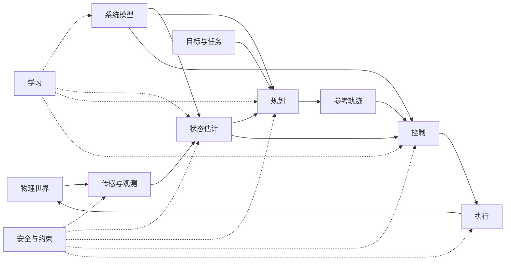

# Chapter 2 自主系统的完整闭环（The Autonomous-System Loop）

[← 第1章](01-从物理世界到系统.md) · [目录](../SUMMARY.md) · [第3章 →](03-层级-接口与时间尺度.md)

**小节导航**

- [2.1 物理世界](#ch2-sec1)
- [2.2 传感与观测](#ch2-sec2)
- [2.3 建模：世界如何变化](#ch2-sec3)
- [2.4 估计：系统认为自己在哪里](#ch2-sec4)
- [2.5 目标与任务](#ch2-sec5)
- [2.6 规划：未来希望怎样变化](#ch2-sec6)
- [2.7 参考轨迹与参考状态](#ch2-sec7)
- [2.8 控制：怎样改变系统](#ch2-sec8)
- [2.9 执行：控制量怎样进入现实](#ch2-sec9)
- [2.10 反馈：现实怎样重新进入系统](#ch2-sec10)
- [2.11 学习：哪些模块可以被数据改变](#ch2-sec11)
- [2.12 安全与约束](#ch2-sec12)
- [2.13 从感知—思考—行动到完整闭环](#ch2-sec13)

上一章建立了“系统”的基本边界：系统具有状态、输入、输出，并与环境持续交换物质、能量和信息。本章进一步回答一个更具体的问题：

> 一个能够感知环境、选择行动并修正自身行为的自主系统，究竟如何形成完整闭环？

最基本的自主系统循环可以概括为

$$
\boxed{
\text{物理世界}
\rightarrow
\text{传感与观测}
\rightarrow
\text{建模与估计}
\rightarrow
\text{目标与规划}
\rightarrow
\text{参考}
\rightarrow
\text{控制与执行}
\rightarrow
\text{物理世界}
}
$$

这条主链并不是简单的流水线。模型同时服务于估计、规划和控制；反馈会跨越多个层级；学习可以改变若干模块；安全与约束则横贯整个系统。为使各部分保持具体，本章采用一个贯穿例子：一台固定基座的七自由度机械臂，需要从传送带上识别并抓取杯子，再将其放入指定托盘。任务涉及相机、编码器、运动学与动力学模型、状态估计、抓取与避障规划、轨迹跟踪、电机驱动以及碰撞保护。

## 2.1 物理世界

物理世界（physical world）是自主系统实际作用的对象，包括机器人本体、被操作物体、人员、障碍物、地面、光照和通信设施等。它不等于软件中的场景，也不等于数学模型。设系统真实状态为 $x_k\in\mathbb{R}^n$ ，控制作用为 $u_k\in\mathbb{R}^m$ ，离散时间动力学可一般地写成

$$
x_{k+1}=f_{\mathrm{real}}(x_k,u_k,d_k),
$$

其中 $d_k\in\mathbb{R}^p$ 表示外部扰动及未受系统控制的环境变量。对机械臂， $x_k$ 可以包含关节位置 $q\in\mathbb{R}^7$ 、关节速度 $\dot q\in\mathbb{R}^7$ 、电机或柔性关节状态，以及杯子的位姿； $u_k$ 可以是期望关节力矩、电机电流或驱动器接受的其他命令。

现实具有模型无法完全覆盖的细节。常用近似是

$$
x_{k+1}
=
f_{\mathrm{model}}(x_k,u_k)
+
\Delta f(x_k,u_k)
+
G_k w_k,
$$

其中 $f_{\mathrm{model}}$ 是设计者使用的模型， $\Delta f$ 是结构性模型误差， $w_k\in\mathbb{R}^r$ 是过程扰动， $G_k\in\mathbb{R}^{n\times r}$ 将扰动映射到状态空间。摩擦变化、杯中液体晃动、传送带速度波动和机械臂负载误差，都可能进入后两项。随机变量只是描述不确定性的一种方式，并不意味着所有误差本质上都是随机的。

工程上的第一条边界是：**模型不是现实，仿真也不是现实。** 如果机械臂在仿真中避开了障碍物，只能说明它在给定模型和数值精度下避开了虚拟障碍物；标定误差、结构变形和控制延迟仍可能使真实机械臂发生碰撞。闭环存在的根本意义，正是在每次行动后重新接收现实的信息，而不是假定一次预测永久正确。

## 2.2 传感与观测

传感器（sensor）把物理量转换为电信号或数字数据，观测（observation）则是经过采样、时间戳、标定、同步和预处理后进入算法的信息。二者不能混为一谈：相机是传感器，一帧带时间戳并经过去畸变的图像是观测；编码器是传感器，换算为弧度的关节角序列是观测。一般观测模型为

$$
y_k=h(x_k)+b_k+v_k,
$$

其中 $y_k\in\mathbb{R}^{s}$ 是观测， $h:\mathbb{R}^n\rightarrow\mathbb{R}^s$ 是观测函数， $b_k$ 是偏置， $v_k$ 是测量噪声。若编码器只测量机械臂的关节位置，则对状态
$x=[q^\mathsf{T},\dot q^\mathsf{T}]^\mathsf{T}\in\mathbb{R}^{14}$ ，有

$$
y_k
=
\begin{bmatrix}I_7&0\end{bmatrix}x_k+v_k
=
q_k+v_k.
$$

这说明观测通常不等于完整状态。杯子的三维位姿也不是相机直接“测得”的量：相机首先产生像素和深度，视觉算法再根据内外参数、特征和几何关系生成位姿观测。若相机数据的时间戳落后于编码器数据 $80\,\mathrm{ms}$ ，把二者当作同一时刻的信息会造成空间融合误差，传送带运动越快，误差越明显。

传感链中的典型非理想因素包括量化、饱和、偏置、漂移、遮挡、丢包、延迟和坐标系标定误差。工程上不仅要记录观测值，还应保留时间戳、坐标系、单位、有效标志和置信度。例如“杯子位于 $(0.4,0.2,0.1)$ ”是不完整的接口；必须说明该向量以米为单位、表达在哪个坐标系、对应何时以及估计协方差是多少。

一个常见误区是把高精度传感器等同于高质量状态信息。高分辨率相机在强反光、运动模糊或错误标定下仍可能给出很差的位姿观测；高速编码器也不能自动提供无噪声速度。传感与观测解决的是“获得了什么数据”，而从这些数据推断“系统现在处于什么状态”属于估计问题。

## 2.3 建模：世界如何变化

建模（modeling）回答“给定当前状态和作用，世界下一步如何变化”。连续时间状态空间模型通常写为

$$
\dot x(t)=f(x(t),u(t),d(t);\theta),\qquad
y(t)=h(x(t);\theta)+v(t),
$$

其中 $\theta$ 是质量、惯量、摩擦系数、相机外参等模型参数。以采样周期 $T_s$ 离散化后，可得到

$$
x_{k+1}=f_d(x_k,u_k;\theta)+w_k.
$$

连续模型适于表达物理机制，离散模型适于数字估计、规划和控制。二者之间取决于离散化方法和输入在采样区间内的保持假设，不能简单地把 $\dot x$ 替换为 $x_{k+1}$ 。

七自由度刚性机械臂的关节动力学可写为

$$
M(q)\ddot q+C(q,\dot q)\dot q+g(q)+\tau_f(q,\dot q)
=
\tau+\tau_{\mathrm{ext}},
$$

其中 $M(q)\in\mathbb{R}^{7\times7}$ 是正定惯性矩阵， $C(q,\dot q)\dot q\in\mathbb{R}^7$ 表示科里奥利和离心项， $g(q)\in\mathbb{R}^7$ 是重力项， $\tau_f$ 是摩擦力矩， $\tau$ 是执行器施加的关节力矩， $\tau_{\mathrm{ext}}$ 是外部接触力矩。视觉侧还需要杯子运动模型，例如在短时间内假设传送带上的杯子以近似恒定速度运动。不同模型描述不同对象和时间尺度，但必须通过统一的状态、单位和坐标系连接起来。

同一个系统往往需要多种保真度的模型。全局规划可以使用几何碰撞模型，轨迹优化可能使用简化动力学，关节控制使用较精细的刚体模型，驱动器内部还会使用电机电气模型。模型越详细并不一定越好；实时计算预算、参数可辨识性和任务所需精度同样重要。忽略接触动力学来规划自由空间运动是合理简化，用同一模型预测抓取瞬间的冲击则可能失效。

模型至少有三种用途：估计器用它从上一时刻预测当前状态；规划器用它检验未来动作是否可行；控制器用它产生前馈补偿或预测闭环响应。后续章节会分别展开这些方法，本章只强调一个统一原则：模型是各模块共享的“变化规律”，而不是只属于控制器的一组公式。

## 2.4 估计：系统认为自己在哪里

状态估计（state estimation）根据历史观测、历史输入和模型，构造真实状态的估计 $\hat x_k$ ，必要时还给出不确定性。严格地说，估计目标可以是条件分布

$$
p(x_k\mid y_{0:k},u_{0:k-1}),
$$

其中 $y_{0:k}$ 表示从时刻 $0$ 到 $k$ 的全部观测。只输出单个向量 $\hat x_k$ 相当于用均值、最大后验值或其他代表值压缩该分布。若后续安全判断依赖不确定性，仅有点估计通常不够。

许多递推估计器都包含“预测—修正”两步：

$$
\hat x_{k|k-1}=f_d(\hat x_{k-1|k-1},u_{k-1}),
$$

$$
r_k=y_k-h(\hat x_{k|k-1}),
$$

$$
\hat x_{k|k}
=
\hat x_{k|k-1}+K_k r_k.
$$

这里 $\hat x_{k|k-1}$ 是先验预测， $r_k\in\mathbb{R}^s$ 是观测残差或创新， $K_k\in\mathbb{R}^{n\times s}$ 是修正增益。卡尔曼滤波在特定线性高斯假设下计算最优增益；扩展卡尔曼滤波、无迹滤波和粒子滤波处理不同程度的非线性或非高斯性，但“模型传播信息、观测纠正预测”的机制是共通的。

在贯穿例子中，编码器提供关节角，估计器可融合动力学模型来估计关节速度；视觉跟踪器根据连续图像和传送带模型估计杯子当前位姿及速度；力矩观测器还可估计异常接触。控制器实际使用的是 $\hat q$ 、 $\hat{\dot q}$ 和杯子预测位姿，而不是不可直接访问的真实状态。

估计结果必须带有明确语义。相机坐标系下的杯子位姿不能未经变换就与基座坐标系下的机械臂状态组合；延迟观测不能被当作当前观测；估计器发散、协方差过小和未检测的传感器偏置都会向规划与控制传播风险。所谓“系统认为自己在哪里”不保证这个判断正确，因此还要监控残差、一致性和置信度。

## 2.5 目标与任务

目标（goal）描述期望达到的结果，任务（task）则通常还包含执行对象、前置条件、阶段顺序、成功判据和失败处理。机械臂的高层任务可以是“抓取传送带上的目标杯并放入托盘”；其目标可能被分解为识别目标、接近预抓取位姿、闭合夹爪、抬升、搬运和释放。单一目标状态 $x_{\mathrm{goal}}$ 无法完整表达这些离散阶段。

目标常有三种数学形式。第一种是目标点或目标集合：

$$
x_N=x_{\mathrm{goal}},
\qquad\text{或}\qquad
x_N\in\mathcal G.
$$

第二种是性能指标，例如有限时域代价

$$
J=
\phi(x_N)+
\sum_{k=0}^{N-1}
\ell(x_k,u_k),
$$

其中 $\ell$ 是阶段代价， $\phi$ 是终端代价。第三种是必须满足的约束，例如 $x_k\in\mathcal X$ 、 $u_k\in\mathcal U$ 。目标集合表达“何时算完成”，代价函数比较“哪个方案更好”，约束定义“哪些方案不允许”，三者不能互相混淆。

例如抓取任务可以要求杯子最终位于托盘区域 $\mathcal G$ ，并最小化

$$
J=
\sum_{k=0}^{N-1}
\left(
\|x_k-x_k^{\mathrm{ref}}\|_Q^2
+
\|u_k\|_R^2
\right)
+
\|x_N-x_{\mathrm{goal}}\|_P^2,
$$

其中 $\|z\|_Q^2=z^\mathsf{T}Qz$ ， $Q,R,P$ 为半正定或正定权重矩阵。避碰和关节限位通常应作为硬约束，而不只是给碰撞配置增加有限惩罚；否则优化器可能为了降低其他代价而接受碰撞。

工程上还要处理多目标冲突。最短时间、最低能耗、最大安全距离和最小杯中液体晃动往往不能同时最优，需要通过优先级、权重或词典序规则明确取舍。目标若含糊，规划器和控制器再精确也只能精确地执行一个错误定义的任务。

## 2.6 规划：未来希望怎样变化

规划（planning）从当前估计状态出发，寻找通向目标的可行未来。典型有限时域规划问题为

$$
\begin{aligned}
\min_{\{x_k,u_k\}} \quad&
\phi(x_N)+\sum_{k=0}^{N-1}\ell(x_k,u_k)\\
\text{s.t.}\quad&
x_{k+1}=f_d(x_k,u_k),\\
&x_0=\hat x_{\mathrm{now}},\\
&x_k\in\mathcal X_k,\quad u_k\in\mathcal U_k,\\
&x_N\in\mathcal G.
\end{aligned}
$$

决策变量包含未来状态序列和输入序列， $N$ 是规划步数。实际规划器可能直接在配置空间搜索路径，也可能通过轨迹优化、采样搜索或动态规划近似求解这一问题。

路径（path）、轨迹（trajectory）和策略（policy）要加以区分。路径只描述几何顺序，如关节空间曲线 $q(s)$ ，其中 $s$ 是路径参数；轨迹带有时间参数，如 $q(t)$ 、 $\dot q(t)$ 和 $\ddot q(t)$ ；策略则根据未来实际状态选择动作，如 $u_k=\pi_k(x_k)$ 。对于传送带抓取，只规划一条静态几何路径不够，因为杯子位置随时间变化，机械臂必须在合适时刻到达抓取位姿。

贯穿例子中的规划可以分层完成：任务规划选择“抓哪只杯子以及采用哪个抓取姿态”；运动规划在七维关节空间中避开设备和自身碰撞；时间参数化保证速度、加速度和力矩限制；若杯子预测位置发生明显变化，局部规划器重新规划接近段。全局规划关注可达性和绕障，局部规划关注短时变化，两者不必以相同频率运行。

规划结果始终依赖当前估计和模型。把 $\hat x_{\mathrm{now}}$ 当成绝对真值、把移动人员当成静态障碍、或者输出超出执行器能力的轨迹，都会产生“数学可行、物理不可行”的方案。处理不确定性的方式包括增加安全裕度、使用概率约束、生成备用方案和滚动重规划，但任何方法都需要明确其假设。

## 2.7 参考轨迹与参考状态

规划器通常不直接输出电机电压，而是通过参考状态（reference state）或参考轨迹（reference trajectory）与控制器连接。机械臂常见接口为

$$
q^{\mathrm{ref}}(t),\qquad
\dot q^{\mathrm{ref}}(t),\qquad
\ddot q^{\mathrm{ref}}(t),
$$

三者均为七维向量。任务空间接口也可以是期望末端位姿 $T^{\mathrm{ref}}(t)\in SE(3)$ 、期望速度和期望接触力。参考量规定“希望系统怎样运动”，控制量则规定“此刻对执行器施加什么作用”，二者维度和物理意义不同。

从无碰路径 $q(s)$ 到可执行参考轨迹，通常还需进行平滑和时间参数化。令 $s=s(t)$ ，则

$$
\dot q(t)=\frac{\partial q}{\partial s}\dot s(t),
$$

$$
\ddot q(t)
=
\frac{\partial^2q}{\partial s^2}\dot s^2(t)
+
\frac{\partial q}{\partial s}\ddot s(t).
$$

因此，即使几何路径不变，不同的 $\dot s$ 和 $\ddot s$ 也会产生不同速度、加速度和所需力矩。规划路径后简单按固定采样点发送位置命令，可能造成速度不连续或不可实现的瞬时加速度。

参考生成还承担层间解耦作用。上层可以每几十毫秒更新一次抓取轨迹，下层控制器则以更高频率插值并跟踪当前参考。接口应规定时间基准、连续性阶次、坐标系、单位和过期处理方式。如果新参考突然跳变，控制器可能输出很大的瞬时作用；如果规划数据过期，继续跟踪旧轨迹可能比停止更危险。

参考不等于保证。即使参考轨迹满足名义模型中的约束，真实系统也会因跟踪误差偏离它。因此碰撞检查不能只检查参考中心线，还应考虑控制误差、估计误差和机械结构尺寸形成的占用包络。

## 2.8 控制：怎样改变系统

控制（control）根据参考和当前状态估计生成控制命令。一般形式为

$$
u_k=\pi(\hat x_k,r_k),
$$

其中 $r_k$ 是参考信息， $\pi$ 是控制律。控制器的核心不是计算一次动作，而是在每个控制周期重新比较现实估计与目标，根据误差持续修正作用。

机械臂关节空间的比例—微分控制可写为

$$
\tau_{\mathrm{fb}}
=
K_p(q^{\mathrm{ref}}-\hat q)
+
K_d(\dot q^{\mathrm{ref}}-\hat{\dot q}),
$$

其中 $K_p,K_d\in\mathbb{R}^{7\times7}$ 通常取对角正定矩阵， $\tau_{\mathrm{fb}}\in\mathbb{R}^7$ 是反馈力矩。若加入逆动力学前馈，可令

$$
\tau_{\mathrm{cmd}}
=
\hat M(\hat q)\ddot q^{\mathrm{ref}}
+
\hat C(\hat q,\hat{\dot q})\dot q^{\mathrm{ref}}
+
\hat g(\hat q)
+
\tau_{\mathrm{fb}}.
$$

前馈项根据模型预测维持参考运动所需的力矩，反馈项纠正初始误差、扰动和模型偏差。只有前馈时，误差不会自动被观测并修正；只有高增益反馈时，则可能放大噪声、激发未建模柔性或要求不可实现的执行器带宽。

PID、线性二次型调节器、模型预测控制和学习策略都可以承担控制律的角色，但算法名称并不自动决定控制层级。模型预测控制可以输出关节力矩，也可以输出较慢的速度参考；学习策略也可能输出任务空间增量，再由传统控制器执行。判断一个模块是否属于控制，关键在于它是否基于当前状态持续生成作用，而不是它使用了哪一种算法。

控制设计必须结合稳定性、鲁棒性、采样频率、噪声和饱和。在线性化模型 $x_{k+1}=Ax_k+Bu_k$ 上设计的反馈 $u_k=-Kx_k$ ，得到闭环矩阵 $A-BK$ ；其离散时间稳定性要求相关工作区域内特征值位于单位圆内。但局部线性结论不能直接外推到强接触、严重饱和或估计器失效的情形。

## 2.9 执行：控制量怎样进入现实

控制器计算出的 $u_k$ 只是数字，执行（execution）负责把它转化为真实的力、力矩、流量或运动。机械臂中的典型链路是

$$
\tau_{\mathrm{cmd}}
\rightarrow
i_q^{\mathrm{ref}}
\rightarrow
\text{电流控制}
\rightarrow
\text{逆变器电压}
\rightarrow
\text{电机电流}
\rightarrow
\text{电磁转矩}
\rightarrow
\text{关节力矩}.
$$

在理想永磁电机模型中，电机转矩可近似写为 $\tau_m=K_t i_q$ ，其中 $K_t$ 为转矩常数。但减速器效率、传动比、摩擦、齿隙和柔性会使最终关节力矩不再等于简单比例映射。

执行器自身具有动态特性。可用简化的一阶模型表示实际作用 $u^{\mathrm{act}}$ 对命令 $u^{\mathrm{cmd}}$ 的响应：

$$
\tau_a\dot u^{\mathrm{act}}+u^{\mathrm{act}}
=
\operatorname{sat}\!\left(u^{\mathrm{cmd}}\right),
$$

其中 $\tau_a>0$ 是执行器时间常数， $\operatorname{sat}(\cdot)$ 表示幅值饱和。实际系统还可能有变化率限制

$$
\|u_k^{\mathrm{act}}-u_{k-1}^{\mathrm{act}}\|
\le \Delta u_{\max},
$$

以及通信延迟、死区、温升降额和电源功率约束。规划器和控制器如果忽略这些限制，就会要求硬件执行不可能的动作，并产生积分饱和、跟踪滞后或保护停机。

执行层通常包含比机器人控制更快的内环。例如关节控制器输出力矩参考，驱动器内部用高速电流环跟踪对应电流。这种分层允许上层近似地把执行器视为力矩源，但前提是内环足够快、稳定且未饱和。一旦电流限幅或总线电压不足，该近似便不再成立。

工程上必须区分“已发送”“已接收”“已执行”和“已验证”。通信接口返回成功，只能证明命令可能到达驱动器；是否形成了期望力矩，还需由电流、位置或力矩观测验证。执行层是软件意图进入现实的最后边界，也是许多安全保护最接近物理作用的位置。

## 2.10 反馈：现实怎样重新进入系统

反馈（feedback）是把行动后的现实结果重新引入决策过程。一次控制作用使世界由 $x_k$ 演化到 $x_{k+1}$ ，传感器产生新观测 $y_{k+1}$ ，估计器更新 $\hat x_{k+1}$ ，控制器再生成 $u_{k+1}$ ：

$$
\begin{aligned}
x_{k+1}&=f_{\mathrm{real}}(x_k,u_k,d_k),\\
y_{k+1}&=h(x_{k+1})+v_{k+1},\\
\hat x_{k+1}&=\mathcal E(\hat x_k,u_k,y_{k+1}),\\
u_{k+1}&=\pi(\hat x_{k+1},r_{k+1}).
\end{aligned}
$$

其中 $\mathcal E$ 表示估计更新。闭环的价值不在于消除所有误差，而在于让误差能够被观察并影响后续行动。

自主系统通常同时存在多个反馈环。驱动器电流环反馈电流，关节环反馈位置和速度，任务空间控制反馈末端位姿，局部规划器根据新障碍物和新目标位置重新规划，任务管理器则根据“抓取成功或失败”切换阶段。越靠近物理执行的环通常越快，越抽象的任务反馈通常越慢或由事件触发。

贯穿例子中，机械臂接近杯子时，视觉系统发现杯子比预测位置提前了 $3\,\mathrm{cm}$ 。如果误差仍处于局部控制和抓取策略可处理的范围，参考可以在线修正；若偏差超出可达窗口，规划器应放弃当前轨迹并重新规划；若相机失去目标，则任务层可能退回搜索阶段。反馈因此不仅是“误差乘一个增益”，还包括估计更新、重规划和离散模式切换。

延迟是反馈的关键边界。若总延迟接近被控对象的主要时间尺度，控制器看到的是过去而非现在，过大的增益可能导致振荡。时间戳错误、线程抖动和网络排队都会增加相位滞后。工程上应测量端到端延迟和抖动，而不能仅凭各模块标称频率推断闭环性能。

## 2.11 学习：哪些模块可以被数据改变

学习（learning）不是闭环中一个固定位置，而是利用数据改变模型参数、状态表示、代价函数、规划启发式或控制策略的机制。设可学习模块参数为 $\theta$ ，数据集为

$$
\mathcal D=\{(z_i,t_i)\}_{i=1}^{N},
$$

监督学习可通过

$$
\theta^\star
=
\arg\min_\theta
\sum_{i=1}^{N}
L(g_\theta(z_i),t_i)
+
\lambda\Omega(\theta)
$$

获得参数，其中 $L$ 是损失函数， $\Omega$ 是正则项， $\lambda\ge0$ 控制其权重。自主系统还可能使用自监督学习、模仿学习或强化学习，但训练目标与任务成功、安全约束并不天然等价。

在机械臂例子中，学习可以用于从图像检测杯子、估计抓取质量、辨识负载质量、学习难以建模的摩擦残差，或预测某条规划分支的成功概率。一个常用的混合模型是

$$
f_{\mathrm{pred}}(x,u)
=
f_{\mathrm{physics}}(x,u)
+
f_\theta(x,u),
$$

其中物理模型提供已知结构，学习模型补偿残差。相较于完全忽略物理结构，这种方式往往更易解释，也更容易限制学习项的作用范围，但仍需检查残差模型在新工况下是否可靠。

应区分在线推断、在线适应和离线训练。视觉网络在运行时输出杯子位姿属于推断；根据新负载逐步更新质量参数属于在线适应；用大量日志重新训练模型后再部署属于离线训练。三者对计算预算、验证流程和故障风险的要求不同。允许模型在真实运行中自动更新，意味着系统行为会随时间改变，必须设置更新速率、参数范围、回滚机制和审计记录。

“数据多”不等于“闭环可靠”。训练分布外输入、错误标签、传感器偏置和闭环数据相关性都可能造成失效。尤其当学习策略的动作改变了未来数据分布时，静态测试集性能不能直接代表长期闭环性能。学习模块应暴露置信度和适用范围，并由约束、监控或后备控制器限制其失效后果，而不是把所有不确定性隐藏在一个网络输出中。

## 2.12 安全与约束

安全（safety）要求系统在完成任务的同时避免不可接受的状态和作用。设允许状态集合为

$$
\mathcal X_{\mathrm{safe}}
=
\{x\mid h_i(x)\ge0,\ i=1,\ldots,r\},
$$

其中每个 $h_i$ 描述一类安全裕度。机械臂的安全条件可以包括关节限位

$$
q_{\min}\le q\le q_{\max},
$$

速度和力矩限制

$$
|\dot q_j|\le \dot q_{j,\max},
\qquad
|\tau_j|\le \tau_{j,\max},
$$

以及与人员和障碍物保持最小距离。温度、电流、通信状态和估计置信度同样可以成为安全条件。

安全不能只放在规划器中。规划器检查名义轨迹碰撞，控制器限制输入并维持跟踪包络，驱动器实施电流和温度保护，估计器检测观测异常，任务层管理失败恢复，独立安全控制器则可在主计算链失效时触发减速或急停。不同层的保护应相互补充，而不是假定某一层永不失效。

一种在线安全过滤思想是：先由名义控制器给出 $u_{\mathrm{nom}}$ ，再求解

$$
\begin{aligned}
u^\star=\arg\min_u\quad&
\|u-u_{\mathrm{nom}}\|^2\\
\text{s.t.}\quad&
h_i\!\left(f_d(\hat x,u)\right)\ge0,\\
&u\in\mathcal U.
\end{aligned}
$$

若模型和状态估计足够准确，该过滤器可选择最接近名义动作的可行控制量。但它不是无条件保证：模型误差、观测延迟、求解失败以及不可避免状态都可能破坏约束。因此实际系统还要使用鲁棒裕度、可达性分析、故障检测和物理急停等措施。

必须区分硬约束、软约束和偏好。人员碰撞通常属于不能主动违反的硬约束；轨迹平滑可以作为代价偏好；某些性能边界可通过松弛变量暂时软化。把所有要求都写成加权代价会导致安全与性能交换，把所有要求都设为硬约束则可能使问题频繁无解。设计者需要规定无解时的确定行为，例如保持、受控停车、撤退或切换到安全模式。

## 2.13 从感知—思考—行动到完整闭环

“感知—思考—行动”（Sense–Think–Act）提供了直观入口：

$$
\text{Sense}\rightarrow\text{Think}\rightarrow\text{Act}.
$$

但它过于粗粒度，容易掩盖关键接口。“感知”至少包含物理传感、观测预处理和状态估计；“思考”包含模型、目标、预测和规划；“行动”包含参考生成、反馈控制、驱动执行和物理响应。更完整的结构是

$$
\boxed{
\text{世界}
\rightarrow
\text{观测}
\rightarrow
\text{估计}
\rightarrow
\text{规划}
\rightarrow
\text{参考}
\rightarrow
\text{控制}
\rightarrow
\text{执行}
\rightarrow
\text{世界}
}
$$

模型连接估计、规划和控制，学习改变其中可数据化的部分，安全约束则监督所有模块：

这张图还需要沿时间尺度展开。机械臂驱动器的电流环可能以千赫兹级运行，关节控制和状态估计以数百赫兹到千赫兹运行，局部规划以数十赫兹或事件触发运行，任务规划则可能只在任务状态变化时运行。快环处理快速物理动态，慢环处理较长预测范围和较高抽象层级。不同频率之间必须通过缓冲、插值、时间戳和超时规则连接，否则“每个模块都正确”仍可能组成一个错误系统。

完整闭环通常也形成分层架构：

1. **任务层**决定抓取哪个对象、当前处于哪个任务阶段；
2. **规划层**生成无碰且可执行的路径与轨迹；
3. **控制层**根据状态估计跟踪参考并抑制扰动；
4. **执行层**把力矩或速度命令转换为电机作用；
5. **物理层**产生真实运动、接触和新的观测。

层级是架构轴，PID、线性二次型调节器、模型预测控制、采样规划和强化学习则属于方法轴。同一层可以使用不同算法，同一算法也可被用于不同层。因而“使用了学习”不意味着取消模型、控制或安全层，“使用了模型预测控制”也不意味着整个系统只剩一个控制器。

对贯穿例子而言，完整一次闭环是：相机和编码器观测机械臂与杯子；估计器融合时间和坐标信息；任务层选定目标杯；规划器预测杯子未来位置并生成避障抓取轨迹；参考生成器给出带时间的关节状态；控制器计算力矩命令；驱动器将命令转换为电流和机械作用；机械臂运动后产生新的图像、关节角和接触信息；若杯子偏移、抓取失败或人员进入工作区，系统根据反馈重规划、恢复或安全停车。自主性不在其中某个单独算法，而在这条信息—决策—作用链能够持续闭合。

判断任何新方法在系统中的位置，可以依次追问：

- 它使用什么输入，这些输入来自真实观测、状态估计还是模型预测？
- 它输出状态、轨迹、控制命令，还是模型参数？
- 它以什么频率运行，允许多大端到端延迟？
- 它依赖哪些动力学、噪声或环境假设？
- 它失败时如何被检测，后续模块采取什么行为？
- 它改变的是名义性能，还是能够验证的安全边界？

用这些问题审视系统，可以避免把估计误认为感知真值、把规划轨迹误认为实际运动、把控制命令误认为执行器输出，也可以避免把学习算法当作无需接口和约束的独立智能体。Chapter 3 将给出贯穿后续分析所需的数学语言，使本章的模块关系能够被统一表达和推导。

## 本章小结

自主系统是一个作用于物理世界并不断接收现实反馈的闭环，而不是若干算法的线性拼接。本章的主线可以归纳为：

- **物理世界**按真实规律演化，包含扰动、未知参数和未建模现象；
- **传感与观测**提供带噪声、延迟和坐标语义的数据，而非完整真值；
- **模型**描述世界如何变化，并同时支持估计、规划和控制；
- **估计**根据模型与观测形成系统对当前状态及其不确定性的判断；
- **目标与任务**定义成功条件、性能指标和不可违反的约束；
- **规划**选择可行未来，**参考轨迹**把规划结果转换为控制接口；
- **控制**持续根据估计状态修正作用，**执行层**把数字命令变为真实物理作用；
- **反馈**让行动结果重新影响估计、控制、规划和任务状态；
- **学习**可以修改多个模块，但必须受数据分布、验证和运行边界约束；
- **安全**横跨观测、估计、规划、控制、执行和系统级故障处理。

这张闭环总图是后续章节的共同坐标系。接下来需要进一步统一状态、向量、函数、概率、优化和动态系统等表达方式，从而能够精确描述各模块的输入、输出、假设及相互作用。

---

[← 第1章](01-从物理世界到系统.md) · [目录](../SUMMARY.md) · [第3章 →](03-层级-接口与时间尺度.md)
