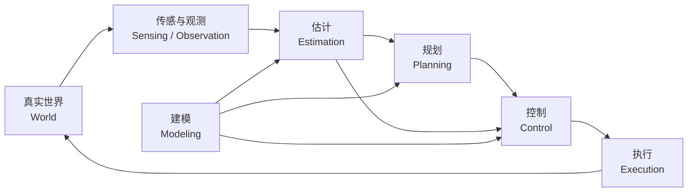

# 前言

[返回首页](../README.md) · [完整目录](../SUMMARY.md)

**小节导航**

- [0.1 为什么需要一套统一的系统观（Unified System View）](#preface-sec1)
- [0.2 从“学习算法”到“理解系统”（From Algorithms to Systems）](#preface-sec2)
- [0.3 本书的核心架构（Core Architecture）](#preface-sec3)
- [0.4 为什么不按照 PID、Kalman、MPC、RL 来组织知识](#preface-sec4)
- [0.5 领域建模与通用数学方法](#preface-sec5)
- [0.6 贯穿全书的真实系统实例](#preface-sec6)
- [0.7 理论、仿真、代码与真实硬件之间的关系](#preface-sec7)
- [0.8 如何使用本书：先建立地图，再深入细节](#preface-sec8)

--- 

<a id="preface-sec1"></a>
## 0.1 为什么需要一套统一的系统观（Unified System View）

如果第一次接触自动控制、机器人或者自主系统，一个非常自然的学习方式是按照算法名称不断向前推进：

PID、卡尔曼滤波（Kalman Filter）、A*、RRT、LQR、MPC、强化学习（Reinforcement Learning, RL）……

学得越来越多之后，却很容易出现一个问题：

> 我知道很多算法，但当真正面对一个新的物理系统时，我仍然不知道应该从哪里开始。

例如，现在桌面上放着一台从未见过的机器人。我们希望它完成一个任务。真正需要解决的问题其实并不是“应该使用 PID 还是 MPC”，而是一系列更加基础的问题：

- 这个系统由什么组成？
- 哪些变量能够描述它当前的状态？
- 我能够测量到什么？
- 哪些状态无法直接测量，需要估计？
- 输入会如何改变系统未来的状态？
- 希望系统未来变成什么样？
- 怎样生成一条可行的运动过程？
- 怎样让真实系统跟随这条运动？
- 控制指令最终怎样变成电流、力矩和真实运动？
- 如果模型不准确、环境变化或者传感器存在噪声怎么办？

这些问题实际上描述了一条完整的因果链。

本书将这条链概括为：

$$
\boxed{
\text{建模}
\rightarrow
\text{估计}
\rightarrow
\text{规划}
\rightarrow
\text{控制}
\rightarrow
\text{执行}
}
$$

其中，学习（Learning）可以作用于每一个环节，而反馈（Feedback）把整个系统重新连接到真实世界。

换句话说：

> **建模描述世界，估计认识世界，规划决定未来，控制改变世界，执行让这种改变真正发生，而学习不断修正我们对世界和行为的理解。**

这就是本书所采用的统一系统观。

---

<a id="preface-sec2"></a>

## 0.2 从“学习算法”到“理解系统”（From Algorithms to Systems）

传统学习中，我们很容易把知识组织成一个“算法动物园”：

```text
PID
LQR
Kalman Filter
A*
RRT
MPC
EKF
DDP
RL
...
```

这种方式适合快速认识工具，却不适合建立长期稳定的知识体系。

因为算法本身并不是问题。

算法只是针对某类问题，在某些假设下形成的一种求解方法。

例如：

- PID 本质上在利用误差反馈调节系统；
- 卡尔曼滤波本质上在有模型、有噪声的情况下估计状态；
- A* 本质上在图结构中寻找低代价路径；
- RRT 本质上在高维连续空间中通过随机采样寻找可行路径；
- LQR 本质上在已知线性动力学下求解二次型最优控制问题；
- MPC 本质上不断预测未来并在线求解一个有限时域优化问题；
- 强化学习本质上通过交互数据寻找能够获得高长期回报的策略。

如果只记住算法，我们看到的是：

$$
\text{PID},\quad
\text{LQR},\quad
\text{MPC},\quad
\text{RL}
$$

如果理解系统，我们看到的则是：

$$
\text{State}
\rightarrow
\text{Dynamics}
\rightarrow
\text{Observation}
\rightarrow
\text{Objective}
\rightarrow
\text{Constraint}
\rightarrow
\text{Decision}
$$

算法只是这个结构中的不同求解器。

因此，本书希望建立一种不同的学习习惯：

> 面对任何新算法，首先不要问“公式是什么”，而要问“它在整个系统中解决哪一个问题？”

一旦这个问题能够回答，新的算法就不再是孤立知识，而会自然挂到已有的知识树上。

---

<a id="preface-sec3"></a>

## 0.3 本书的核心架构（Core Architecture）

本书将一个完整自主系统拆分为五个主要功能层：



### 建模（Modeling）

建模回答：

> **这个世界是怎样变化的？**

我们试图用数学表达真实系统：

$$
\dot{x}=f(x,u,d,\theta,t)
$$

这里可以包含刚体运动、电机、电路、空气动力学、摩擦、柔性、接触和环境。

模型不是现实本身，而是为了分析、预测和控制现实而建立的近似。

### 估计（Estimation）

现实中的完整状态通常无法直接获得。

传感器真正给我们的通常是：

$$
y=h(x)+v
$$

因此我们需要根据模型和测量值推断：

$$
\hat{x}
$$

也就是对真实状态 \(x\) 的估计。

滤波器、观测器、卡尔曼滤波以及多传感器融合都属于这一层。

### 规划（Planning）

知道“现在在哪里”之后，还需要决定：

> **接下来应该去哪里？**

规划的输出可能是一条路径、一条轨迹、一组未来状态，甚至是一整个策略：

$$
x^\*(t),\qquad
q^\*(t),\qquad
\pi(x)
$$

A*、RRT、轨迹优化和部分动态规划方法，都可以理解为不同形式的未来决策。

### 控制（Control）

规划告诉系统“应该怎样运动”，控制解决的是：

> **怎样让真实系统真的这样运动？**

控制器根据目标状态与实际状态产生控制输入：

$$
u=\pi(x,x^{\ast})
$$

最简单可以是 PID，更复杂可以是状态反馈、LQR、计算力矩控制、MPC 或非线性控制。

### 执行（Execution）

理论中的控制输入 \(u\) 并不会自动进入现实世界。

它最终必须经过：

```text
控制算法
↓
离散计算
↓
实时任务
↓
通信
↓
驱动器
↓
电流环
↓
电机
↓
减速机构
↓
物理运动
```

因此，实时系统、离散化、控制频率、通信延迟、FOC、执行器饱和和硬件限制都不是“工程杂项”，而是完整控制系统不可分割的一部分。

### 学习（Learning）

学习并不是固定在上述链条中的某一个位置。

它可能用于：

$$
\text{Learning}
\rightarrow
\begin{cases}
\text{Model}\\
\text{Estimator}\\
\text{Planner}\\
\text{Controller}\\
\text{Cost Function}
\end{cases}
$$

因此，本书不会把学习简单理解为“用神经网络替代控制器”。

更重要的问题是：

> **系统中的哪一部分无法可靠地由人工建模或设计，因此值得从数据中学习？**

---

<a id="preface-sec4"></a>

## 0.4 为什么不按照 PID、Kalman、MPC、RL 来组织知识

按照算法名称组织知识有一个隐含问题：

**它把方法放在了问题之前。**

但真实工程过程通常恰恰相反。

例如面对一个机械系统，首先需要确定状态：

$$
x=
\begin{bmatrix}
q\\
\dot q
\end{bmatrix}
$$

然后建立动力学：


$$
M(q)\ddot q+C(q,\dot q)\dot q+g(q)=\tau
$$


接下来才会出现不同问题。

如果速度无法准确测量，这是一个**估计问题**。

如果需要从起点绕过障碍到达终点，这是一个**规划问题**。

如果已经有目标轨迹，希望系统跟踪它，这是一个**控制问题**。

如果控制器无法直接驱动电机，还需要考虑电流环和实时通信，这是一个**执行问题**。

如果模型中的摩擦无法准确描述，可以进一步引入**系统辨识或学习方法**。

于是 PID、Kalman、RRT、MPC 和 RL 自然会出现在不同位置。

本书因此不会问：

> “我们什么时候应该学习 MPC？”

而更希望回答：

> “当一个系统需要根据模型预测未来、显式处理约束，并不断根据当前状态重新规划控制输入时，为什么 MPC 会自然出现？”

这样学习到的不是算法名称，而是算法产生的原因。

---

<a id="preface-sec5"></a>

## 0.5 领域建模与通用数学方法

不同系统遵循不同的物理规律。

机械系统可能从牛顿定律或欧拉—拉格朗日方程出发；

电机需要同时考虑电磁和机械动力学；

无人机需要处理三维刚体运动、推力和空气动力学；

车辆还需要轮胎与地面之间的作用；

四足机器人则进一步引入浮动基座和多点接触。

因此：

> **建模具有领域性。**

但是这些系统在经过数学抽象之后，又经常可以写成相似形式：

$$
\dot{x}=f(x,u)
$$

或者离散形式：

$$
x_{k+1}=f(x_k,u_k)
$$

这时很多分析、估计、规划和控制方法又重新具有通用性。

例如，同样的状态空间思想可以用于：

- 电机；
- 倒立摆；
- 机械臂；
- 无人机；
- 四足机器人。

同样的优化理论可以用于：

- 轨迹优化；
- LQR；
- MPC；
- 系统辨识；
- 机器学习。

同样的概率理论可以用于：

- 传感器建模；
- Kalman Filter；
- 贝叶斯估计；
- 随机规划；
- 强化学习。

因此，本书会始终区分两个层次：

```text
领域规律
↓
建立具体模型
↓
转换为数学结构
↓
使用通用方法
```

这也是为什么本书既需要讲机械、电机、刚体运动等具体知识，又需要不断回到三个更基础的数学核心：

$$
\boxed{
\text{动力学（Dynamics)}
+
\text{概率（Probability)}
+
\text{优化（Optimization)}
}
$$

---

<a id="preface-sec6"></a>

## 0.6 贯穿全书的真实系统实例

为了避免每一章都停留在抽象公式上，本书会使用同一套真实物理系统贯穿主要章节，其中机械臂将作为最主要的实验平台。

但机械臂在本书中不是独立的知识分类。

我们不会采用：

```text
机械臂
├── 建模
├── 规划
└── 控制
```

而采用：

```text
建模
├── 通用理论
└── 机械臂实例

估计
├── 通用理论
└── 机械臂实例

规划
├── 通用理论
└── 机械臂实例

控制
├── 通用理论
└── 机械臂实例
```

例如，在建模部分，我们会使用机械臂理解：

- DH 与 MDH；
- 旋量理论（Screw Theory）；
- 指数积公式（Product of Exponentials, POE）；
- 雅可比矩阵（Jacobian）；
- Newton–Euler；
- Euler–Lagrange。

进入估计部分以后，仍然使用同一系统研究：

- 编码器测量；
- 速度估计；
- 外力估计；
- 扰动观测器；
- Kalman Filter。

进入规划部分，再让同一机械臂完成：

- 轨迹生成；
- 逆运动学；
- 碰撞检测；
- RRT；
- 轨迹优化。

最终进入控制与执行：

- PID；
- 重力补偿；
- 计算力矩控制；
- LQR；
- MPC；
- 实时循环；
- 电机驱动；
- FOC；
- 通信延迟；
- 硬件实验。

这样，读者看到的不是几十个互相独立的演示，而是：

> **同一个物理系统如何随着知识增加，被我们一步一步理解得更加完整。**

同时，本书也会穿插电机、无人机、移动机器人和四足机器人，用来说明哪些知识是机械臂特有的，哪些方法具有更普遍的意义。

---

<a id="preface-sec7"></a>

## 0.7 理论、仿真、代码与真实硬件之间的关系

控制与机器人领域一个常见的问题是，理论、代码和硬件往往被分成三个世界。

理论中：

$$
\dot{x}=f(x,u)
$$

仿真中：

```python
x_next = dynamics(x, u, dt)
```

而真实硬件中可能变成：

```text
读取编码器
↓
滤波
↓
状态估计
↓
控制计算
↓
限幅
↓
CAN FD
↓
电机驱动器
↓
FOC
↓
真实关节
```

这三者实际上应该描述同一个系统。

因此，本书中的重要章节会尽可能形成四层对应：

### 1. 数学理论

回答：

> 为什么成立？

### 2. 数值实现

回答：

> 怎样把公式变成算法？

### 3. 仿真实验

回答：

> 在理想或可控环境中，这个算法表现如何？

### 4. 真实硬件

回答：

> 当噪声、延迟、摩擦、饱和和模型误差真正出现以后，它还是否有效？

理想情况下，一个概念最终都应该经历：

$$
\boxed{
\text{Theory}
\rightarrow
\text{Code}
\rightarrow
\text{Simulation}
\rightarrow
\text{Hardware}
}
$$

因为真正理解一个控制算法，并不只是能够推导公式，也不只是能够调用一个软件库。

真正的理解意味着：

> 知道它为什么工作，知道怎样实现，知道它什么时候失效，也知道真实系统为什么和公式中的系统不一样。

---

<a id="preface-sec8"></a>

## 0.8 如何使用本书：先建立地图，再深入细节

这本书并不要求第一次阅读时理解所有数学细节。

更推荐的方式是：

> **先建立全局地图，再逐层深入。**

第一次阅读时，重点理解：

```text
建模解决什么？
估计解决什么？
规划解决什么？
控制解决什么？
执行解决什么？
学习又在哪里出现？
```

第二次阅读，再进入每一个模块内部的方法。

例如：

```text
建模
├── 物理建模
├── 运动学
├── 动力学
├── 执行器
└── 状态空间

估计
├── 信号处理
├── Observer
├── Bayesian Estimation
└── Kalman Filter

规划
├── Trajectory Generation
├── Search-Based Planning
├── Sampling-Based Planning
└── Trajectory Optimization

控制
├── PID
├── State Feedback
├── LQR
├── MPC
├── Nonlinear Control
└── Robust / Adaptive Control
```

第三次阅读，再深入公式、证明、数值实现以及实际工程问题。

因此，当你在某一章节遇到暂时无法完全理解的数学内容时，不必停下来试图一次性解决所有问题。

先知道：

> **这个知识点在整张地图中的位置。**

然后继续前进。

随着不同模块之间的连接逐渐建立，很多曾经孤立的概念会开始互相解释。

最终，我们希望形成一种面对新系统时可以反复使用的思考方式：

$$
\boxed{
\begin{aligned}
&\text{系统是什么？}\\
&\text{状态是什么？}\\
&\text{输入是什么？}\\
&\text{能够观测什么？}\\
&\text{世界如何变化？}\\
&\text{希望未来怎样变化？}\\
&\text{怎样让这种变化发生？}\\
&\text{真实硬件怎样执行？}\\
&\text{哪里存在不确定性？}\\
&\text{哪里值得使用学习？}
\end{aligned}
}
$$

当这些问题能够被系统地回答以后，PID、Kalman、RRT、MPC、强化学习等算法就不再是零散的名词。

它们只是我们构造完整自主系统时，在不同位置选择的工具。

而这本书最终希望建立的，也正是这种能力：

> **不是记住最多的算法，而是能够从一个真实问题出发，独立完成从建模、估计、规划、控制到执行的完整闭环，并知道什么时候应该让系统从数据中学习。**

---

[返回首页](../README.md) · [完整目录](../SUMMARY.md) · [第1章 →](../01-System/01-什么是系统.md)
