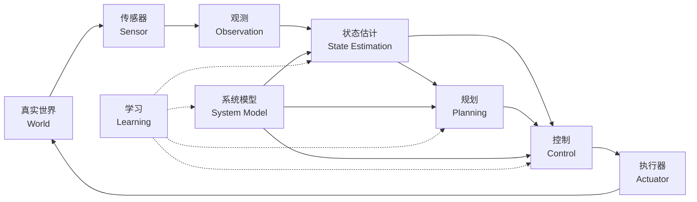
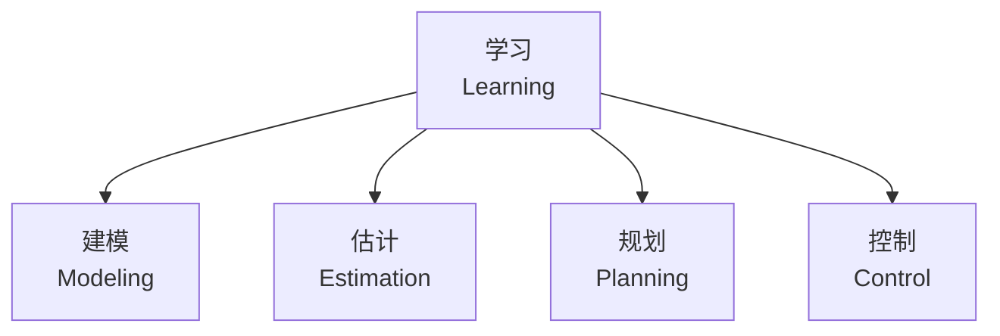
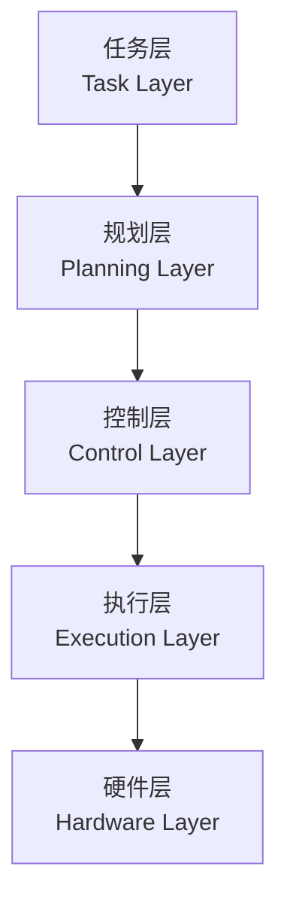
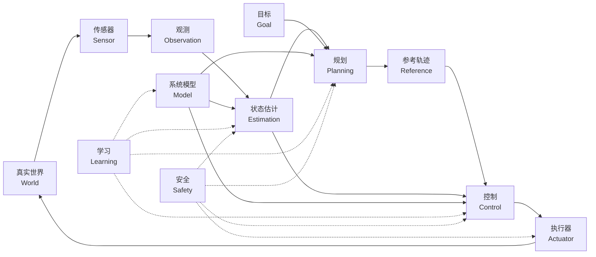

# 第2章 自主系统的完整闭环（Complete Closed Loop of Autonomous Systems）

[← 第1章](01-什么是系统.md) · [目录](../SUMMARY.md) · [第3章 →](03-贯穿全书的数学语言.md)

**小节导航**

- [2.1 真实世界（World）](#ch2-sec1)
- [2.2 传感器（Sensor）](#ch2-sec2)
- [2.3 观测（Observation）](#ch2-sec3)
- [2.4 状态估计（State Estimation）](#ch2-sec4)
- [2.5 系统模型（System Model）](#ch2-sec5)
- [2.6 目标（Goal）](#ch2-sec6)
- [2.7 规划（Planning）](#ch2-sec7)
- [2.8 参考量与目标轨迹（Reference and Desired Trajectory）](#ch2-sec8)
- [2.9 控制（Control）](#ch2-sec9)
- [2.10 执行器（Actuator）](#ch2-sec10)
- [2.11 物理响应（Physical Response）](#ch2-sec11)
- [2.12 反馈（Feedback）](#ch2-sec12)
- [2.13 学习（Learning）](#ch2-sec13)
- [2.14 安全（Safety）](#ch2-sec14)
- [2.15 系统中的不同时间尺度（Multiple Time Scales）](#ch2-sec15)
- [2.16 分层控制架构（Hierarchical Control Architecture）](#ch2-sec16)
- [2.17 从感知—思考—行动到闭环自主系统（Sense–Think–Act to Closed-Loop Autonomy）](#ch2-sec17)

> 本章属于 **第一篇 世界与系统（World and System）**。机械臂作为贯穿实例，用于连接理论、代码、仿真与真实硬件。

上一章我们回答了“什么是系统”。这一章要回答的问题更进一步：

> **一个能够自主行动的系统，究竟是怎样闭合起来的？**

一个完整的自主系统并不是“传感器 + 控制器 + 电机”这么简单。它至少包含从真实世界获取信息、估计当前状态、预测未来、决定目标、规划行为、生成控制量、通过执行器作用于物理世界，再通过新的观测修正自身的完整循环。

最基本的闭环可以写成：

$$
\boxed{
\text{真实世界}
\rightarrow
\text{观测}
\rightarrow
\text{估计}
\rightarrow
\text{预测}
\rightarrow
\text{规划}
\rightarrow
\text{控制}
\rightarrow
\text{执行}
\rightarrow
\text{真实世界}
}
$$

其中：

- 建模（Modeling）提供预测世界如何变化的结构；
- 学习（Learning）可以修正模型、估计器、规划器和控制器；
- 安全（Safety）横跨整个系统；
- 反馈（Feedback）让系统不断重新根据现实修正自己的行为。



本章的重点不是深入每个算法，而是先建立这张“全书总地图”。

<a id="ch2-sec1"></a>

## 2.1 真实世界（World）

自主系统最终面对的不是数学公式，而是真实世界。

真实世界具有几个非常重要的特点：

- 状态通常不可完全观测；
- 参数可能未知；
- 环境会变化；
- 传感器存在噪声；
- 执行器存在延迟和饱和；
- 接触、摩擦、碰撞等现象可能高度非线性；
- 我们的模型永远只是现实的近似。

因此，真实系统并不会“按照模型运行”。

更准确地说，是我们使用模型去近似真实系统。

如果模型写成：

$$
x_{k+1}=f_{\text{model}}(x_k,u_k)
$$

真实系统更接近：

$$
x_{k+1}^{\text{real}}=f_{\text{model}}(x_k,u_k)+\Delta f_k+w_k
$$

其中：

-  $\Delta f_k$：模型误差（Model Error）；
-  $w_k$ ：未建模扰动或随机扰动。

这也是闭环控制存在的根本原因之一。

如果模型永远精确、环境永远不变、传感器永远没有噪声，那么很多系统甚至可以只依靠开环预测完成任务。

但现实世界不是这样。

因此：

> **自主系统的核心不是“计算出一次正确答案”，而是不断根据真实世界重新修正答案。**

---

<a id="ch2-sec2"></a>

## 2.2 传感器（Sensor）

传感器（Sensor）是系统与真实世界之间最重要的信息接口之一。

机器人并不能直接“知道”世界是什么样，而是通过传感器获得关于世界的有限信息。

机械臂中常见传感器包括：

- 编码器（Encoder）；
- 电流传感器（Current Sensor）；
- 力矩传感器（Torque Sensor）；
- 六维力/力矩传感器（Force/Torque Sensor）；
- 相机（Camera）；
- 深度相机（Depth Camera）；
- 惯性测量单元（Inertial Measurement Unit, IMU）；
- 温度传感器（Temperature Sensor）。

不同传感器观察不同物理量。

例如：

```text
编码器→ 关节角度

电流传感器→ 电机电流

力传感器→ 接触力

相机→ 图像

IMU→ 加速度与角速度
```

这里一个重要思想是：

> **传感器测到的量，不一定就是我们真正想知道的状态。**

例如编码器测量的是位置，而控制器可能需要位置、速度甚至外部扰动力。

因此：

```text
真实世界
↓
传感器
↓
测量值
```

并不等于：

```text
真实状态
```

传感器只是信息来源。

---

<a id="ch2-sec3"></a>

## 2.3 观测（Observation）

观测（Observation）是传感器输出经过采样、转换、同步和预处理后，真正进入计算系统的信息。

通常可以写成：

$$
y_k=h(x_k)+v_k
$$

其中：

-  $x_k$：真实状态；
-  $y_k$：观测；
-  $h(\cdot)$：观测模型；
-  $v_k$ ：测量噪声。

例如机械臂状态为：

$$
x=\begin{bmatrix}q\\\dot q\end{bmatrix}
$$

但编码器可能只给出：

$$
y=q+v
$$

此时观测只是状态的一部分。

实际系统中的观测还会受到：

- 量化；
- 噪声；
- 偏置；
- 漂移；
- 延迟；
- 丢包；
- 时间戳误差；

等因素影响。

所以在工程上：

> **“传感器读数”并不是绝对真值。**

我们得到的只是带有误差的观测。

这就是估计问题出现的起点。

---

<a id="ch2-sec4"></a>

## 2.4 状态估计（State Estimation）

状态估计（State Estimation）的目标是：

> **根据不完整、有噪声的观测，以及系统模型，推断系统当前真正处于什么状态。**

通常记作：

$$
\hat{x}_k
$$

其中  $\hat{x}_k$是对真实状态  $x_k$ 的估计。

典型结构：

```text
历史状态估计+系统模型+控制输入+当前测量
↓
状态估计器
↓
新的状态估计
```

例如：

$$
\hat{x}_{k|k-1}=f(\hat{x}_{k-1},u_{k-1})
$$

这是根据模型做预测。

然后根据测量：

$$
y_k
$$

对预测进行修正：

$$
\hat{x}_{k|k}=\hat{x}_{k|k-1}+\text{Correction}
$$

这一思想贯穿很多估计方法：

- 龙伯格观测器（Luenberger Observer）；
- 扰动观测器（Disturbance Observer）；
- 卡尔曼滤波（Kalman Filter）；
- 扩展卡尔曼滤波（Extended Kalman Filter, EKF）；
- 无迹卡尔曼滤波（Unscented Kalman Filter, UKF）；
- 粒子滤波（Particle Filter）。

对于机械臂而言，估计器可以用于估计：

- 关节速度；
- 加速度；
- 外部扰动力矩；
- 接触力；
- 电机状态；
- 柔性状态。

因此：

> **控制器真正使用的往往不是“真实状态”，而是“估计状态”。**

---

<a id="ch2-sec5"></a>

## 2.5 系统模型（System Model）

系统模型（System Model）负责回答：

> **如果当前状态是这样，并施加一个输入，系统未来会怎样变化？**

连续模型：

$$
\dot{x}=f(x,u)
$$

离散模型：

$$
x_{k+1}=f(x_k,u_k)
$$

模型在整个自主系统中并不只服务于控制器。

它还可以服务于：

### 状态估计

根据模型预测下一时刻：

$$
\hat{x}_{k+1|k}=f(\hat{x}_k,u_k)
$$

### 规划

预测某一系列动作可能产生的未来轨迹：

$$
x_0\xrightarrow{u_0}x_1\xrightarrow{u_1}x_2\rightarrow\cdots
$$

### 控制

计算为了实现目标应该产生怎样的控制作用。

例如模型预测控制（Model Predictive Control, MPC）直接依赖预测模型。

### 学习

模型本身也可以从数据中被修正。

因此，系统模型实际上是估计、规划和控制之间的重要共享结构。

但需要牢记：

$$
\boxed{\text{Model} \neq \text{Reality}}
$$

一个好的模型不是“包含现实所有细节的模型”，而是：

> **对于当前任务足够准确、足够简单、足够可计算的模型。**

---

<a id="ch2-sec6"></a>

## 2.6 目标（Goal）

知道系统现在在哪里，并不意味着知道它应该去哪里。

目标（Goal）用于描述我们希望系统达到的结果。

最简单的目标可以是一个状态：

$$
x_{\text{goal}}
$$

例如：

$$
q_{\text{goal}}
$$

表示希望机械臂关节移动到某个位置。

目标也可以是末端位姿：

$$
T_{\text{goal}}\in SE(3)
$$

还可以是一个目标集合：

$$
x\in\mathcal{G}
$$

例如“末端到达某个区域即可”。

更复杂的目标甚至可以是：

- 最小能耗；
- 最短时间；
- 最小跟踪误差；
- 最大安全裕度；
- 完成抓取任务；
- 避开障碍物；
- 保持平衡。

这时目标往往会进一步写成优化问题：

$$
\min J
$$

例如：

$$
J=\sum_{k=0}^{N}\left[(x_k-x_k^{ref})^TQ(x_k-x_k^{ref})+u_k^TRu_k\right]
$$

因此：

> **目标定义了系统“什么叫做做得好”。**

---

<a id="ch2-sec7"></a>

## 2.7 规划（Planning）

规划（Planning）解决的是：

> **从当前状态到目标之间，应该怎样走？**

如果当前状态：

$$
x_0
$$

目标状态：

$$
x_g
$$

规划器需要找到一条可行路径或轨迹：

$$
x_0 \rightarrow x_1\rightarrow \cdots\rightarrow x_g
$$

同时满足约束。

例如机械臂规划需要考虑：

- 关节限位；
- 障碍物；
- 自碰撞；
- 速度限制；
- 加速度限制；
- 动力学可行性。

规划方法可以非常不同。

例如：

- A*；
- Dijkstra；
- 概率路图法（Probabilistic Roadmap, PRM）；
- 快速扩展随机树（Rapidly-Exploring Random Tree, RRT）；
- RRT*；
- 轨迹优化（Trajectory Optimization）；
- 动态规划（Dynamic Programming）。

它们看似差异很大，但都在回答同一件事：

> **未来应该如何演化。**

---

<a id="ch2-sec8"></a>

## 2.8 参考量与目标轨迹（Reference and Desired Trajectory）

规划器通常不会直接控制电机。

它更常输出某种参考量（Reference）或目标轨迹（Desired Trajectory）。

例如：

$$
q^{\ast}(t)
$$

表示目标关节位置。

也可能同时给出：

$$
q^{\ast}(t),\quad\dot q^{\ast}(t),\quad\ddot q^{\ast}(t)
$$

对于任务空间控制，也可能给出：

$$
x^{\ast}(t)
$$

或者：

$$
T^{\ast}(t)
$$

因此规划与控制之间常见接口是：

```text
规划器
↓
目标轨迹
↓
控制器
```

例如：

```text
RRT
↓
无碰路径
↓
轨迹平滑 / 时间参数化
↓
q*(t), q̇*(t), q̈*(t)
↓
控制器
```

参考轨迹是一个非常重要的“中间语言”。

规划关心：

> “应该怎样运动？”

控制关心：

> “怎样让真实系统跟上这个目标运动？”

---

<a id="ch2-sec9"></a>

## 2.9 控制（Control）

控制器（Controller）根据目标与当前状态生成控制输入：

$$
u=\pi(\hat{x},x^{\ast})
$$

最简单的关节 PD 控制：

$$
\tau=K_p(q^{\ast}-q)+K_d(\dot q^{\ast}-\dot q)
$$

如果加入动力学模型，可以形成计算力矩控制：

$$
\tau=M(q)v+C(q,\dot q)\dot q+g(q)
$$

其中：

$$
v=\ddot q^{\ast}+K_d(\dot q^{\ast}-\dot q)+K_p(q^{\ast}-q)
$$

也可以进一步使用 LQR、MPC 等方法。

控制的核心并不是“计算一个输入”，而是：

> **持续根据真实系统当前状态修正输入。**

因此控制器一般运行在循环中：

```text
读取状态
↓
比较目标
↓
计算控制量
↓
输出
↓
再次读取状态
```

这就是反馈控制。

---

<a id="ch2-sec10"></a>

## 2.10 执行器（Actuator）

控制算法计算出来的 \(u\) 只是一个数字。

真正改变物理世界的是执行器（Actuator）。

对于机械臂，执行链可能是：

```text
期望关节力矩
↓
期望电机力矩
↓
期望 q 轴电流
↓
FOC 电流控制
↓
逆变器
↓
电机电流
↓
电磁转矩
↓
减速器
↓
关节力矩
```

理想情况下：

$$
\tau=K_t i_q
$$

但真实系统还会受到：

- 电流饱和；
- 电压限制；
- 反电动势；
- 减速器效率；
- 摩擦；
- 齿隙；
- 柔性；
- 驱动器延迟；

等因素影响。

因此执行器不能简单看作“把控制量原样执行”。

它本身也是一个动态系统。

---

<a id="ch2-sec11"></a>

## 2.11 物理响应（Physical Response）

执行器产生力和力矩以后，真实系统开始运动。

例如机械臂：

$$
M(q)\ddot q+C(q,\dot q)\dot q+g(q)+\tau_f=\tau+\tau_{ext}
$$

这里控制器施加的 \(\tau\) 只是影响运动的一部分。

真实运动还受到：

- 重力；
- 惯性；
- 科里奥利力；
- 摩擦；
- 外力；
- 接触；
- 结构柔性；

等影响。

所以：

$$
u\not\Rightarrow x_{\text{desired}}
$$

控制输入并不会直接等于目标状态。

它只是改变动力学演化。

更准确地说：

$$
u \rightarrow \dot{x} \rightarrow x
$$

这也是为什么控制问题必须理解动力学。

---

<a id="ch2-sec12"></a>

## 2.12 反馈（Feedback）

反馈（Feedback）是整个闭环系统真正的中心。

真实系统执行之后，会产生新的状态：

$$
x_{k+1}
$$

传感器再次测量：

$$
y_{k+1}
$$

估计器得到：

$$
\hat{x}_{k+1}
$$

控制器再根据新的状态重新计算：

$$
u_{k+1}
$$

因此：

```text
观测
↓
估计
↓
控制
↓
执行
↓
世界变化
↓
再次观测
```

形成闭环。

数学上可以写成：

$$
u_k=\pi(\hat{x}_k)
$$

$$
x_{k+1}=f(x_k,u_k)
$$

然后：

$$
y_{k+1}=h(x_{k+1})+v_{k+1}
$$

反馈真正解决的问题是：

> **即使预测不完全正确，我们仍然能够不断根据现实重新修正行为。**

这也是为什么控制系统可以容忍一定程度的模型误差。

---

<a id="ch2-sec13"></a>

## 2.13 学习（Learning）

学习（Learning）不是整个系统中的一个固定方框。

它更像一个横跨各层的修正机制。

学习可以用于：

### 学习模型

$$
x_{k+1}=f_\theta(x_k,u_k)
$$

### 学习模型残差

$$
f_{\text{real}}=f_{\text{physics}}+f_\theta
$$

### 学习估计器

从传感器数据中直接学习状态表示。

### 学习规划策略

例如学习启发函数、价值函数或世界模型。

### 学习控制策略

$$
u=\pi_\theta(x)
$$

### 学习代价函数

从人类示范或任务数据中学习“什么行为更好”。

因此：



一个重要原则是：

> **不是因为可以使用学习，就必须使用学习。**

更合理的问题是：

> 哪一部分最难可靠建模、设计或适应，因此值得从数据中学习？

---

<a id="ch2-sec14"></a>

## 2.14 安全（Safety）

一个自主系统不能只追求“完成任务”。

它还必须保证：

> **不要因为完成任务而进入危险状态。**

安全约束可能包括：

$$
q_{min}\le q\le q_{max}
$$

$$
|\tau|\le\tau_{max}
$$

$$
T\le T_{max}
$$

以及：

- 不撞人；
- 不撞环境；
- 不超过电机电流；
- 不超过关节速度；
- 不进入奇异危险区域；
- 通信故障时进入安全模式；
- 传感器异常时停止运动。

安全并不是规划器或控制器单独负责的。

它通常横跨：

```text
传感器
↓
异常检测

估计器
↓
置信度检查

规划器
↓
碰撞与安全距离约束

控制器
↓
输入与状态约束

执行器
↓
电流 / 温度 / 功率保护

系统级
↓
急停与故障安全
```

因此可以把安全理解为：

$$
\boxed{
\text{Safety}
\text{ is a cross-cutting constraint}
}
$$

---

<a id="ch2-sec15"></a>

## 2.15 系统中的不同时间尺度（Multiple Time Scales）

完整机器人系统中的所有模块并不会以同一个频率运行。

例如：

| 模块 | 典型时间尺度 |
| --- | --- |
| 电流环 | 很快 |
| 速度环 | 快 |
| 位置环 | 中等 |
| 状态估计 | 中高频 |
| 局部规划 | 中低频 |
| 全局规划 | 较低频 |
| 学习更新 | 可能更慢 |

以机械臂为例，可以形成：

```text
电流控制
~ kHz 级

关节控制
~ 数百 Hz 到 kHz

状态估计
~ 数百 Hz

轨迹规划
~ 数十 Hz 或事件触发

全局任务规划
~ 更低频
```

这里的具体数值取决于系统，但核心思想不变：

> **不同模块处理不同时间尺度上的问题。**

如果把所有计算都强行放在同一个循环里，会造成：

- 计算资源浪费；
- 实时性下降；
- 控制抖动；
- 不必要的延迟。

这就是多速率系统（Multi-Rate System）出现的原因。

---

<a id="ch2-sec16"></a>

## 2.16 分层控制架构（Hierarchical Control Architecture）

由于目标抽象层级和时间尺度不同，自主系统通常采用分层架构（Hierarchical Architecture）。

例如机械臂系统：

```text
任务层
“把杯子拿到桌上”
↓
任务规划

运动层
生成末端路径 / 关节轨迹
↓
运动规划

控制层
计算目标关节力矩
↓
机器人控制

执行层
将力矩变成电流
↓
电机控制

硬件层
PWM / 逆变器 / 电机
```

可以写成：



上层通常：

- 更抽象；
- 运行更慢；
- 预测更长时间范围。

下层通常：

- 更接近物理系统；
- 运行更快；
- 对实时性要求更高。

这就是为什么一个自主机器人通常不是“一个控制器”，而是多个层级共同工作的系统。

---

<a id="ch2-sec17"></a>

## 2.17 从感知—思考—行动到闭环自主系统（Sense–Think–Act to Closed-Loop Autonomy）

很多自主系统会被概括为：

$$
\text{Sense} \rightarrow \text{Think} \rightarrow \text{Act}
$$

即：

```text
感知
↓
思考
↓
行动
```

这个框架非常直观，但对真正设计系统来说还不够精细。

“感知”内部至少可以分为：

```text
传感器
↓
观测
↓
状态估计
```

“思考”可以进一步分为：

```text
模型
+
目标
↓
预测
↓
规划
```

“行动”可以进一步分为：

```text
控制
↓
执行器
↓
物理响应
```

于是更完整的自主系统是：

$$
\boxed{
\text{World}
\rightarrow
\text{Observation}
\rightarrow
\text{Estimation}
\rightarrow
\text{Prediction}
\rightarrow
\text{Planning}
\rightarrow
\text{Control}
\rightarrow
\text{Execution}
\rightarrow
\text{World}
}
$$

同时：

$$
\boxed{
\text{Learning}
\rightarrow
\{
\text{Modeling},
\text{Estimation},
\text{Planning},
\text{Control}
\}
}
$$

而整个循环真正得以持续工作的核心是：

$$
\boxed{\text{Feedback}}
$$

这张图也是整本书最重要的总图之一：



从这一章之后，全书会开始逐层展开这张图。

我们不会把 PID、Kalman、RRT、LQR、MPC、RL 当作互相孤立的知识点，而会不断追问：

> **它属于整个闭环的哪一个位置？**

例如：

```text
Kalman Filter→ 估计

RRT→ 规划

PID→ 控制

FOC→ 执行

System Identification→ 建模 / 学习

Reinforcement Learning→ 可能跨越规划与控制
```

当这张系统地图建立之后，后面出现的算法会越来越多，但知识体系反而不会越来越乱。

因为所有方法最终都会落回几个基本问题：

1. 世界现在是什么状态？
2. 世界会怎样变化？
3. 我希望未来怎样变化？
4. 应该采取什么行动？
5. 真实硬件如何执行这个行动？
6. 执行结果与预测不一致时，如何修正？
7. 哪些部分应该通过数据进一步学习？

这就是自主系统的完整闭环。

---

[← 第1章](01-什么是系统.md) · [目录](../SUMMARY.md) · [第3章 →](03-贯穿全书的数学语言.md)
